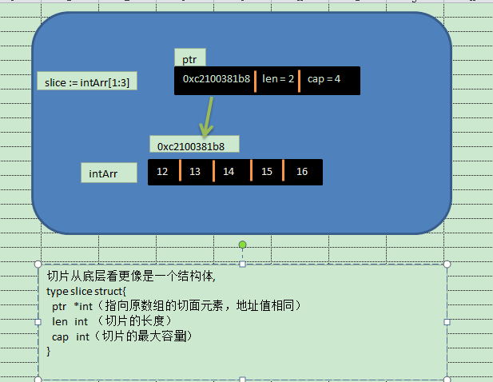

# Go

## 简述：

### 是什么

c、c++这种语言运行非常快，但是开发很慢，

python开发很高效但是运行慢，因为是解释型脚本，边解释边运行

而Go就像是python+c的结合

Go : 一种静态强类型、编译型、并发型，并具有垃圾回收功能的编程语言

优势：

- 简洁、快速、安全
- 并行、垃圾回收
- 内存管理、数组安全、编译迅速

### 能干吗：

1. 云分布式计算
2. 高并发服务端、游戏服务器的开发
3. 分布式文件服务器

## 运行方式

Go 有两种运行方式：

       	1. 直接运行 go run 有main方法的*.go 文件，

2.执行go build 命令将* .go 文件编译生成一个*.exe 文件（windows环境中），然后直接运行该文件

区别：

​	第一种方式方便查看运行结果，但是不适用在正式开发，因为运行慢

​	第二种的运行速度快，而且编译之后可以再别的没有go环境的机器上运行，但是文件很大，因为导入了运行该文件需要记得第三方包或者其他

## 语法：

go语言运行入口必须有main方法

go文件中引入的包必须使用，否则编译不通过

方法中声明的变量没有被使用则编译不通过

### 数据类型

基本数据类型：

​	布尔类型：bool

​	字符串类型：string

​	数字类型：

​		整数型：

​			有符号：int、int8、int16、  int32（rune） 、 int64

​			无符号：uint uint8（byte）、 uint16、 uint32、 uint64 、uintptr（存放指针）

​			其中int、uint 在不同位的操作系统中不同大小，32位大小为int4,64位中大小为int8

​		浮点型：float32、 float64、**complex64** 32 位实数和虚数  、  **complex128** 64 位实数和虚数

派生类型：

​	指针类型（Pointer）、 数组类型、 结构化类型(struct)、 Channel 类型、函数类型、切片类型

​	 接口类型（interface）、 Map 类型

### 变量的声明

单变量的声明：

​	（a）var 变量名 [数据类型]

​	（b）var 变量名 = value	类型自动推断

​	（c）变量名 := value （这种方式相当于先声明一个变量然后给变量赋值，**只能在函数体内出现，并且：左边的变量必须是没有声明过的**）

多变量声明：

​	（a）var 变量1 变量2 .... 变量n  type

​	（b）var 变量1 变量2 .... 变量n = value1，value2，....value n

​	（c）变量1 变量2 .... 变量n := value1，value2，....value n（注意点和上文类似）

​	（d）

```go
// 这种因式分解关键字的写法一般用于声明全局变量
var (
    vname1 v_type1
    vname2 v_type2
)
```

注意点：

​	1.不能对同一变量进行重复声明

​	2. 常量和局部变量冲突时，在函数体内会默认局部变量

```go
package main

import "fmt"
var i = 12
var k = 13;
func main () {
	i,k := 9,10
	fmt.Printf("i 的值是 %d,k 的值是 %d",i,k)
}
====================================================>
i 的值是 9,k 的值是 10
```

### 常量的声明

常量中的数据类型只可以是布尔型、数字型（整数型、浮点型和复数）和字符串型。

常量的声明使用关键字：const

命名方式和变量类似，

```go
//显式类型定义： 
	const b string = "abc"
//隐式类型定义： 
	const b = "abc"
//多个相同类型的声明可以简写为：
	const c_name1, c_name2 = value1, value2

//常量还可以用作枚举：

const (
    Unknown = 0
    Female = 1
    Male = 2
)
```

iota

​	iota 是一个特殊的常量，可以被编译器修改，可以被用作枚举，并且每增加一行， iota就会 + 1

```go
//快速将a，b，c赋予1,2，3
const（
	a = iota
	b
	c
）

const (
            a = iota   //0
            b          //1
            c          //2
            d = "ha"   //独立值，iota += 1
            e          //"ha"   iota += 1
            f = 100    //iota +=1
            g          //100  iota +=1
            h = iota   //7,恢复计数
            i          //8
    )

const (
    i=1<<iota 	//iota = 0
    j=3<<iota	//iota = 1
    k			//3<<iota = 3 << 2
    l			//3<<iota = 3 << 3
)
```

### 流程语句

#### switch

用法和其他语言中switch类似，不同的是当执行结果为true时，go语言会自动退出，不需要加break，

```go
fmt.Print("Go runs on ")
switch os := runtime.GOOS; os {
  case "darwin":
  fmt.Println("OS X.")
  case "linux":
  fmt.Println("Linux.")
  default:
  fmt.Printf("%s.", os)
}
//go语言中case还可以是一个函数
fmt.Println("When's Saturday?")
today := time.Now().Weekday()
switch time.Saturday {
  case today + 0:
  fmt.Println("Today.")
  case today + 1:
  fmt.Println("Tomorrow.")
  case today + 2:
  fmt.Println("In two days.")
  default:
  fmt.Println("Too far away.")
}
//如果switch的表达式为空，则代表true
t := time.Now()
switch {
  case t.Hour() < 12:
  fmt.Println("Good morning!")
  case t.Hour() < 17:
  fmt.Println("Good afternoon.")
  default:
  fmt.Println("Good evening.")
}
```


### 循环语句

go 语言中只提供了一种循环for循环，有以下三种写法

1.和大部分语言中的for类似

​	for init; condition; post { }

2.和while语句类似

​	for condition{}

3.和for(;;)类似

​	for {}

### 函数声明使用

#### 函数声明：

​	func 函数名 ([参数...]) (返回值类型.....)

go语言中函数可以返回多个值

```go
func main() {
	a, b := swap("hello", 2)
	fmt.Println(a, b)
}

func swap(i string, k int) (int, string) {
	return k * 2, i + "asd"
}
//当函数返回多个值接收时的值得用，分隔多个值接受，如果某一个值不想接收，可以用占位符_代替
pp,ll := swap("1",1)
_,ll := swap("1",1)
```

#### 函数的参数传递

函数的形参传递类型分为两种

​	值传递：形参的改变不会改变实参（默认情况下，Go 语言使用的是值传递，即在调用过程中不会影响到实际参数。）

​	引用传递：形参的改变会改变实参

```go
//引用传递的dmeo
func main() {
	a, b := "hello", 2
	fmt.Println(a, b)
	swap(&a,&b)
	fmt.Println(a, b)
}

func swap(i *string, k *int) {
	*k *= 2
	*i += "hello" 
}
//最后输出结束：
//hello 2
//hellohello 4

```


#### 函数的使用

作为变量使用：函数定义后可作为值来使用

```go
func main(){
   /* 声明函数变量 */
   getSquareRoot := func(x float64) float64 {
      return math.Sqrt(x)
   }

   /* 使用函数 */
   fmt.Println(getSquareRoot(9))

}
```

#### 闭包：

闭包是匿名函数，可在动态编程中使用  

闭包的特征就是函数的返回值是一个函数，可以实现延迟执行函数

```go
func main() {
	f := add()
	f(12)
	f(24)
	f(13)
}

func add() func(int){
	x := 12
	return func(de int){
		x += de
		fmt.Println(x)
	}
	
}
//24
//48
//61
```

#### 方法：

一个方法就是一个包含了接受者的函数，接受者可以是命名类型或者结构体类型的一个值或者是一个指针。所有给定类型的方法属于该类型的方法集，类似于java中某一个中类定义的方法，也就是说这个方法只能由指定的类型的对象调用

```go
/* 定义结构体 */
type Circle struct {
  radius float64
}

func main() {
  var c1 Circle
  c1.radius = 10.00
  fmt.Println("圆的面积 = ", c1.getArea())
}

//该 method 属于 Circle 类型对象中的方法
func (c Circle) getArea() float64 {
  //c.radius 即为 Circle 类型对象中的属性
  return 3.14 * c.radius * c.radius
}
//另外注意在上面的getArea()中 的c是Circle的一个别名，在调用时会将调用此方法的变量作为实参传入，如果当前变量是值类型，就进行值拷贝，如果是引用类型，就进行地址拷贝
type Point struct {
	left int
	right string
	mod string
}

func main()  {

	var point Point
	point.left = 13
	fmt.Println("改变前：==> point.left = ",point.left)
	point.test()
	fmt.Println("改变后：==>	point.left = ",point.left)

}

func (p Point)test()  {
	p.left = 12
	fmt.Println("test() ==> point.left = ",p.left)
}
//输出结果
改变前：==> point.left =  13
test() ==> point.left =  12
改变后：==>      point.left =  13

//如果程序要改变结构体中的值
func (p *Point)testPoint()  {
	p.left = 12
}
（&point).testPoint()
```

和函数相类似的是，方法名首字母大写和首字母小写都是控制访问权限。如果一个类型定义了一个String()方法，那么在fmt.Println()默认调用此方法

方法和函数最大区别：

​	函数中如果定义了传递参数是指针类型，那么只能传递指针

​	方法中调用方如果定义了是指针类型，在调用时可以有调用者本身也可以是指向调用者的指针

```markdown
就拿上文中的 testPoint() 方法，上文中的调用方式如下
- （&point).testPoint()
-  但其实也可以这样调用
	- point.testPoint()

```


#### init 函数

init 函数是go语言自带的函数，会在main函数之前使用

#### 内置函数：

​	go语言包含了大量的[内置函数](https://studygolang.com/pkgdoc)，这些函数不需要引入任何的包就能使用，new(..),make(...)等等

##### new

```go
//go语言中的new实际上是一个指向指定类型实例的指针
i := new(int)
fmt.Printf("i的类型 %T \n",i)
//输出结果
i的类型 *int 

```


### 执行顺序

go语言文件执行顺序：全局变量 -> 导入包的init函数 -> main函数

### 数组声明、使用

数组声明：

```go
//一位数组的声明
var 数组名 [数组大小]	类型
//、初始化
var 数组名	 = [数组大小] 类型{数组元素....}

var 数组名	 = [] 类型{数组元素....}
//未知大小，这里的三个点是固定的，不能多不能少
var 数组名	 = [...] 类型{数组元素....}

//二维数组初始化
//注意最后的,不能少，因为最后的}单独一行
var balance = [3][4]int{
  {1,2,3,4},
  {5,6,7,8},
}
//否则如下写法
var balance = [3][4]int{
  {1,2,3,4},
  {5,6,7,8}}
```

作为参数传递

```go
func myFunction(param [10]int){}
func myFunction(param []int){}
```

注意数组的长度定义完之后是不可变的，后面说的切片slice是可变的

### 指针

```go
func main() {
   var a int= 20   /* 声明实际变量 */
   var ip *int        /* 声明指针变量 */

   ip = &a  /* 指针变量的存储地址 */

   fmt.Printf("a 变量的地址是: %x\n", &a  )

   /* 指针变量的存储地址 */
   fmt.Printf("ip 变量储存的指针地址: %x\n", ip )

   /* 使用指针访问值 */
   fmt.Printf("*ip 变量的值: %d\n", *ip )
}
/*
	a 变量的地址是: 20818a220
	ip 变量储存的指针地址: 20818a220
	*ip 变量的值: 20
*/
```

空指针：当一个指针没有被赋值就是nil，空指针

```go
//判断是否是空指针
ptr == nil
```

指针数组的使用

```go
func main() {
   a := []int{10,100,200}
   var i int
   var ptr [MAX]*int;

   for  i = 0; i < MAX; i++ {
      ptr[i] = &a[i] /* 整数地址赋值给指针数组 */
   }

   for  i = 0; i < MAX; i++ {
      fmt.Printf("a[%d] = %d\n", i,*ptr[i] )
   }
}
```

指向指针的指针

```go
//1.指针的声明
	//指针意思就是指向一个变量存储的地址，也就是说其存储的是被指向的变量的地址值
	var ptr *int = &i  //
	fmt.Printf("i 中的变量值是 ==>  %d\n",i)
	//当不加*时表示的是 i 这个变量的地址值
	fmt.Printf("ptr 中的类型是 ==>  %T,  值 ==> %d\n",ptr,ptr)	
	//加*时代表的是 i 这个变量的实际值，也就是说引用i 变量的值
	fmt.Printf("*ptr 中的类型是 ==>  %T, 值 是 == >  %d\n",*ptr,*ptr)	
	//也就是说 *ptr 其实就是int 类型了
	fmt.Printf("&*ptr 中的类型是 ==>  %T, 值 是 == >  %d\n",&*ptr,&*ptr) 
	
/*
	i 中的变量值是 ==>  1
    ptr 中的类型是 ==>  *int,  值 ==> 4284448
    *ptr 中的类型是 ==>  int, 值 是 == >  1
    &*ptr 中的类型是 ==>  *int, 值 是 == >  4284448	
*/

	//声明一个指向指针的指针
	var ppter = &ptr
	//因为ptr是一个指针，代表的是被指向对象（i）的地址值，所以，pptr存储的是ptr的地址值
	fmt.Printf("pptr 中的类型是 ==>  %T,  值 ==> %d\n",ppter,ppter)		
	//*pptr代表的是 被ptr指向的对象 i 中的地址值
	fmt.Printf("*pptr 中的类型是 ==>  %T, 值 是 == >  %d\n",*ppter,*ppter)	
	//**pptr代表的是指向ppter指向的ptr指向的i变量，也就是i的值
	fmt.Printf("*pptr 中的类型是 ==>  %T, 值 是 == >  %d\n",**ppter,**ppter)
/*
	pptr 中的类型是 ==>  **int,  值 ==> 4251944
    *pptr 中的类型是 ==>  *int, 值 是 == >  4284448
    **pptr 中的类型是 ==>  int, 值 是 == >  1
*/
	var pppter = &ppter
	fmt.Printf("pppter 中的类型是 ==>  %T,  值 ==> %d\n",pppter,pppter)
	fmt.Printf("*pppter 中的类型是 ==>  %T, 值 是 == >  %d\n",*pppter,*pppter)
	
/*
    pppter 中的类型是 ==>  ***int,  值 ==> 4251960
    *pppter 中的类型是 ==>  **int, 值 是 == >  4251944
*/
```

### 结构体

数组中只能定义一种类型，但是结构体中可以定义多种类型，有点类似于java中class，结构体是值类型

```go
//声明定义
type struct_variable_type struct {
   member definition;
   member definition;
   ...
   member definition;
}

type Book struct{
	author	string
	title	string
	id		int
}


func main () {
	var book Book
	book.author = "jack"
	book.title = "kk"
	book.id = 132

	fmt.Println(book)
	fmt.Println(Book{author : "lucy",title : "ll"})
}

//结构体作为函数参数传递和普通类型用法是一样的没有区别

//指向结构体的指针的用法也没什么不同
```


使用细节：

​	1.结构体中的字段在内存中是相邻的,就算字段类型是指针就是一样，本身的地址相邻，但是指向的地址不一定相邻

```go

type Point struct {
	left int
	right string
	image *int
	picture *int
}

func main(){
	point := new(Point)
	point.left = 2
	point.right = "3"
	i,l := 2,15
	point.image = &i
	point.picture = &l

	fmt.Printf("point 类型：%T\n",&point)
	fmt.Printf("point.left 地址值：%v \n  ",&point.left)
	fmt.Printf("pont.right 地址值：%v\n",&point.right)
	fmt.Printf("point.image 地址值 %v,指向的地址 %p \n",&point.image,point.image)
	fmt.Printf("point.picture 地址值 %v,指向的地址 %p \n",&point.picture,point.picture)
}
//输出结果
point 类型：**main.Point
point.left 地址值：0xc00000a080 
pont.right 地址值：0xc00000a088
point.image 地址值 0xc00000a090,指向的地址 0xc000016088 
point.picture 地址值 0xc00000a098,指向的地址 0xc000016090 

```

2.类型转换

```go

type Point struct {
	left int
	right string
	mod string
}
//go语言会当成新的类型
type NewPoint Point

type Lint struct{
    left int
    right string
    mod string
}

func main()  {

	point := new(Point)
	newPoint := new(NewPoint)
    
    var po Point
    lint := Lint(po)
	
	point = (*Point)(newPoint)
	fmt.Printf("point ++= %v",point)
}
//go语言中只有字段的类型、数量、名字一样才能就行类型转换
```


### 切片（slice）

因为go语言中数组在定义后长度是不可变的，所以需要一个灵活的动态数组，也即是切片

```go
//切片的定义不需要说明长度
var slice_1 []int
//也可以通过内置的函数make([]T,len,cap)
//len表示初始化长度，cap代表最大容量 5
var slice_1 []int = make([]int,10，50)
//也可以简写为
slice1 := make([]type, len, capacity)
//切片也可以从数组中引用获取
arr := []int{1,2,3}
slice1 := arr[:]
//表示将数组中 下标0 到 1的元素赋值给切片(左闭右开)
slice2 := arr[0:2]
slice3 := arr[0:]
slice4 := arr[:2]

```

内存布局分析



内置函数：

```go
//len():返回切片的长度
//cap():返回切片的容量

//现有一个切片初始化如下
testSlice := []int{0,1,2,3,4,5}
slice1 := testSlice[1:3]
//len=2 cap=6 slice=[1 2]
fmt.Printf("len=%d cap=%d slice=%v\n",len(slice1),cap(slice1),slice1)
slice2 := testSlice[2:4]
//len=2 cap=4 slice=[2 3]
fmt.Printf("len=%d cap=%d slice=%v\n",len(slice2),cap(slice2),slice2)
//如果切片中的元素来源自数组，容量就是原数组中startIndex 到数组中最后一个元素的个数

//append(slice,...):向切片中追加元素
slice2 = append(slice2,8)
//copy(targetSlice,sourceSlice)，将sourceSlice中元素赋值到targetSlice中
//如果被targetSlice容量在一开始定义时被限定，则不会被扩容，只能赋予sourceSlice中cap(targetSlice)个数的元素

```

### 关键字

#### range

作用：用于 for 循环中迭代数组(array)、切片(slice)、通道(channel)或集合(map)的元素。在数组和切片中它返回元素的索引和索引对应的值，在集合中返回 key-value 对的 key 值。

```go
 //这是我们使用range去求一个slice的和。使用数组跟这个很类似
    nums := []int{2, 3, 4}
    sum := 0
    for _, num := range nums {
        sum += num
    }
    fmt.Println("sum:", sum)
    //在数组上使用range将传入index和值两个变量。上面那个例子我们不需要使用该元素的序号，所以我们使用空白符"_"省略了。有时侯我们确实需要知道它的索引。
    for i, num := range nums {
        if num == 3 {
            fmt.Println("index:", i)
        }
    }
    //range也可以用在map的键值对上。
    kvs := map[string]string{"a": "apple", "b": "banana"}
    for k, v := range kvs {
        fmt.Printf("%s -> %s\n", k, v)
    }
    //range也可以用来枚举Unicode字符串。第一个参数是字符的索引，第二个是字符（Unicode的值）本身。
    for i, c := range "go" {
        fmt.Println(i, c)
    }
```

#### defer

延迟执行，等到周边的函数执行完之后在执行

```go
defer fmt.Println("world")
fmt.Println("hello")
//hello world

fmt.Println("counting")
for i := 0; i < 10; i++ {
  defer fmt.Print(i)
}
fmt.Println("done")
//counting
//109876543210
//done

//defer关键字延迟执行的函数都会推到栈中，再推入栈的时候传入函数的参数是参数在当时的值，并不是最终的值，余个例子
pp := 10
defer fmt.Printf("defer 修改pp之后的值为%v \n", pp)
pp += 1
fmt.Printf("修改pp之后的值为%v \n", pp)
//当语句 `fmt.Printf("defer 修改pp之后的值为%v \n", pp)` 再被推入栈中时候，pp的值是10，即使在后面语句执行时进行了修改，结果是
defer 修改pp之后的值为 10
修改pp之后的值为 11

```

注意：

​	1.defer 后面的语句只能是调用某个函数，

​	2.再推入栈的时候传入函数的参数是参数在当时的值，并不会在后续的语句中进行改变

作用：

​	类似于java中的finally{}，可以用来释放资源

### map集合

```go
//声明方式如下
/* 声明变量，默认 map 是 nil */
var map_variable map[key_data_type]value_data_type

/* 使用 make 函数 */
map_variable := make(map[key_data_type]value_data_type)

var countryCapitalMap map[string]string /*创建集合 */
    countryCapitalMap = make(map[string]string)

    /* map插入key - value对,各个国家对应的首都 */
    countryCapitalMap [ "France" ] = "Paris"
    countryCapitalMap [ "Italy" ] = "罗马"
    countryCapitalMap [ "Japan" ] = "东京"
    countryCapitalMap [ "India " ] = "新德里"

    /*使用键输出地图值 */ 
	for country := range countryCapitalMap {
        fmt.Printf("%v首都是%v", country, countryCapitalMap [country])
    }
	for country,value := range countryCapitalMap {
        fmt.Printf( "%v首都是%v", country,value)
    }

    /*查看元素在集合中是否存在 */
    captial, ok := countryCapitalMap [ "美国" ] /*如果确定是真实的,则存在,否则不存在 */
 
    if (ok) {
        fmt.Println("美国的首都是", captial)
    } else {
        fmt.Println("美国的首都不存在")
    }
//删除元素
delete(countryCapitalMap [ "美国" ] )

/**go对于map排序没有内置函数，如果排序只能对key进行排序**/
sort.Int(keys)

for _,k range keys{
    fmt.Printf("map[%v]==%v",k,mapTest[k])
}

/**map是一个引用类型，如果作为参数传那么如果在函数中修改了其中的值，则直接生效***/

```

值得注意的是map中可以实现类似于struct一样的结构，也就是说key的类型可以不一样

```go
	testMap1 := make(map[interface{}]interface{})
	testMap1["hello"] = "world"
	testMap1[6523] = 123
	testMap1["name"] = "jack"

	fmt.Printf("6523 ==> %v",testMap1[6523])

```


### 接口

```go
//g语言中接口的实现
type Phone interface{
	call()
}

type NokiaPhone struct{

}

type IPhone struct{
}

func (nokiaPhone NokiaPhone) call(){
	fmt.Println("im nokia phone")
}
func (iphone IPhone) call(){
	fmt.Println("im iphone")
}

func main() {
	var phone Phone
	
	phone = new(NokiaPhone)
	phone.call()
	
	phone = new(IPhone)
	phone.call()
	
}

```

和java中接口比较

​	相同点：

​		1.实现接口必须实现接口的所有方法

​		2.接口定义时方法不需要有方法体

​		3.接口不能直接实例化，但可以间接赋值

​	不同点：

​		1.java中接口可以定义变量，Go不能定义非接口非匿名的字段

​		2.java中的接口时显式的实现，Go不用

​		3.java中接口只能由类实现，go中接口可以由自定义的类型实现不一定是结构体

#### 接口的继承

```go

```


#### 强大的空接口

go语言中 可以定义一个空接口，此时作用相当于java中T泛型，c中void*

```go
func main() {
	var i interface{}
	describe(i)

	i = 42
	describe(i)

	i = "hello"
	describe(i)
}

func describe(i interface{}) {
	fmt.Printf("(%v, %T)\n", i, i)
}
```

类型推断：

```go
//因为空接口可以使任意类型
func do(i interface{}) {
  	//类型推断返回两个结果，一个是进行转换后的值，也就是下文中 的v，还有一个是boolean类型结果，下文照片那个的result
  v,k := i.(int)
  //同时也可以这样使用，但是注意，这里的i是空接口，且只能是空接口
	switch v := i.(type) {
	case int:
		fmt.Printf("Twice %v is %v\n", v, v*2)
	case string:
		fmt.Printf("%q is %v bytes long\n", v, len(v))
	default:
		fmt.Printf("I don't know about type %T!\n", v)
	}
}

func main() {
	do(21)
	do("hello")
	do(true)
}
```


### 错误类型

go语言定义了一个错误接口

```go
type error interface {
    Error() string
}
//当我们函数有可能存在错误时，类似于java中的抛出异常，也就是将error类型的数据作为返回值
func Sqrt(f float64) (float64, error) {
    if f < 0 {
      //手动调用
        return 0, errors.New("math: square root of negative number")
    }
    // 实现
}

//声明一个实现接口的结构体
type SqrtError struct{
	value float64
}
//实现方法
func (sqrtError SqrtError) Error() string{
	return fmt.Sprintf("输入有误 %v",sqrtError.value)
}

func main() {
	
	result,errorMsg := Sqrt(-1)
	if errorMsg != "" {
		fmt.Println(errorMsg)
	}else{
		fmt.Println(result)
	}
}

func Sqrt(f float64) (float64, string) {
    if f < 0 {
		sqrtError := new(SqrtError)
		sqrtError.value = f
		
        return 0, sqrtError.Error()
    }
    return f,""
}

```

#### 异常的处理机制

​	GO语言中可以使用defer+recover来捕获异常

```go
func testTry(){
  defer func(){
    error := recover()
    if (error != null){
      fmt.Println("捕获到异常")
    }
  }()
}
```


## 面向对象的特性

#### 封装

```go
//go语言实现封装只需要将类作为匿名内部类存在即可

type Person struct{
	Name string
}

type Woman struct{
	Person
	Age int
}

type Man struct{
	Person
	Hobby int
}

func (per *Person)say(){
	fmt.Println("my name is ",per.Name)
}

func main(){
	var w Woman
	var m Man
	
	w.Person.Name = "lucy"
	m.Person.Name = "jack"
	
	w.Person.say()
	m.Person.say()
  
  	//同时代码可以简化
  	w.Name = "lucy"
	m.Name = "jack"
	
	w.say()
	m.say()
  
  //另外一个需要注意的地方，继承的是所有字段包括首字母大写、小写
	
}
```


## 文件操作

```go
import (
	"bufio"
	"fmt"
	"io"
	"os"
)

func main() {
    //open(path string)只能打开、读取文件不能对文件进行写操作
	file, error := os.Open("d:/goTest.txt") // For read access.
    
	if error != nil {
		fmt.Println(error)
	}

	reader := bufio.NewReader(file)

	for {
		str, end := reader.ReadString('\n')
		fmt.Println(str)
		if end == io.EOF {
			break
		}
	}

}
```

```go
//可以自定义打开文件、并且对文件进行读写操作
func OpenFile(name string, flag int, perm FileMode) (*File, error)
//flag参数表示打开文件用途，可以组合使用 O_RDONLY|O_APPEND
const (
        // Exactly one of O_RDONLY, O_WRONLY, or O_RDWR must be specified.
   		//必须指定 O_RDONLY, O_WRONLY, or O_RDWR 其中一个
        O_RDONLY int = syscall.O_RDONLY // open the file read-only.
        O_WRONLY int = syscall.O_WRONLY // open the file write-only.
        O_RDWR   int = syscall.O_RDWR   // open the file read-write.
        // The remaining values may be or'ed in to control behavior.
        O_APPEND int = syscall.O_APPEND // 向文件中添加数据
        O_CREATE int = syscall.O_CREAT  // 如果不存在创建文件
        O_EXCL   int = syscall.O_EXCL   // 和 O_CREATE 配合使用，文件必须不存在
        O_SYNC   int = syscall.O_SYNC   // 同步打开文件 i/o
        O_TRUNC  int = syscall.O_TRUNC  // if possible, truncate file when opened.
)
//FileMode 是一个unit32位，主要用作unix系统中，windows中无效
const (
        // The single letters are the abbreviations
        // used by the String method's formatting.
        ModeDir        FileMode = 1 << (32 - 1 - iota) // d: is a directory
        ModeAppend                                     // a: append-only
        ModeExclusive                                  // l: exclusive use
        ModeTemporary                                  // T: temporary file; Plan 9 only
        ModeSymlink                                    // L: symbolic link
        ModeDevice                                     // D: device file
        ModeNamedPipe                                  // p: named pipe (FIFO)
        ModeSocket                                     // S: Unix domain socket
        ModeSetuid                                     // u: setuid
        ModeSetgid                                     // g: setgid
        ModeCharDevice                                 // c: Unix character device, when ModeDevice is set
        ModeSticky                                     // t: sticky
        ModeIrregular                                  // ?: non-regular file; nothing else is known about this file

        // Mask for the type bits. For regular files, none will be set.
        ModeType = ModeDir | ModeSymlink | ModeNamedPipe | ModeSocket | ModeDevice | ModeIrregular

        ModePerm FileMode = 0777 // Unix permission bits
)
```

进行演示

//===================== 文件的创建、写入

```go

file , err := os.OpenFile("/Users/linsen/Desktop/test.txt",
                          os.O_CREATE | os.O_WRONLY,
                          os.ModePerm)
	//要及时关闭流
	defer file.Close()

	if err != nil {
		fmt.Println("文件打开异常")
	}else {
        //向文件中写入字符串,最后返回的n代表写入的字节数，
        //注意go默认使用utf-8编码所以一个汉字字节数是3，这里的n是18
        n , err := file.WriteString("这世界我来了")
	}


```

//======================= 文件内容添加

```go

file , err := os.OpenFile("/Users/linsen/Desktop/test.txt",
                          os.O_RDWR|os.O_APPEND,
                          os.ModePerm)
defer file.Close()
	if err != nil {
		fmt.Println("文件打开异常")
	}else {
        //当打开文件的操作是append(添加)时，此时向文件中写入数据就会添加在文件的末尾
        n , err := file.WriteString("这世界又我来了")
	}


```

上文中写入还可以使用另一种写入方式

```go
bufio.NewWriter(file *File) (writer *Writer){}
if file != nil {
		 bufio.NewWriter(file)
		 writer.WriteString("hello world！！")	 
    //这一句代码不能省略，因为bufio是缓冲流，他会先将要写入的数据首先缓存在内部的字段 bytes中，然后手动调用Flush()时才真正将数据写入到磁盘中
    	writer.Flush()
    	defer file.Close()
}

```


## goroutine和channel

#### goroutine

​	go语言协程、线程，go语言中有主线程和协程，一个主线程可以起多个协程，协程是轻量级的线程，

​	协程特点：

​		单独的栈空间

​		共享堆内存空间，有相同的地址空间

​		最重要的一点：和java语言中的多线程不同的是，go语言协程内存消耗十分少，因为java中的线程是操作系统的物理线程属于内核态，每次分配最小1M（手动分配有内存溢出风险），而go是逻辑态线程，动态分配线程中内存的大小，[具体看这篇博客](https://www.infoq.cn/article/a-million-go-routines-but-only-1000-java-threads)

​		

 ```go
func main() {
    //让次函数运行在开启的协程中
	go printfln("%v go!",2,"jack")
	go printfln("%v move！",3,"jack")
	printfln("ready ！！！",0)
    //线程睡眠五秒，经测试如果注释这代码，就直接运行完 printfln("ready ！！！",0) 程序会直接退出，(协程是基于主线程的，主线程运行结束协程自然也就销毁),所以睡眠几秒等待运行完成
	time.Sleep(5 * time.Second)

}

func printfln(format string, second int64 ,key ... interface{}){
	time.Sleep(time.Duration(second) * time.Second)
	fmt.Printf(format + "\n",key)
}
 ```

#### channel

​	管道底层就是一个先进先出的队列,**其容量在初始化时就已经确定，不可改变**

```go
chanints := make(chan int, 3)
//向管道中添加值
chanints <- 4
chanints <- 5
chanints <- 6

fmt.Printf("管道中的值：%v,管道本身地址值：%p",chanints,&chanints)

//超出管道的最大容量直接报异常，deadLock
chanints <- 9

```


​	

## 包

### 包的引用

go语言是以包（package）管理项目，

引入语法

```go
//引入单个包
import "fmt"

//引入多个包
import (
	"fmt"
    "os"
    //给包别名
    util "io/util"
)

//注意如果引入的包在程序中没有被使用，在编译阶段会报异常

```


### [os](https://golang.org/pkg/os/)

​	作用：提供了可以直接操作系统的接口，打开文件..

os.Args [] string

​	提供了系统命令行输入的变量，

```go
/src/file.go hhh 89 ij
//此时os.Args中存放的就是 【hhh, 89, ij】

for index,arg := range os.Args {

	fmt.Printf("输入参数 %d ：%v \n",index,arg)

}
//执行如下命令 go run os/operateFile.go helo 327645 jhsdgf ，
//输出如下

//执行文件的临时目录
输入参数 0 ：/var/folders/jj/rktcg3vj4ysb6wv1z9t5xvqr0000gn/T/go-build164164760/b001/exe/operateFile 

输入参数 1 ：helo 
输入参数 2 ：327645 
输入参数 3 ：jhsdgf 

```

### [flag](https://golang.org/pkg/flag/)

作用：实现命令行标签解析

在os包中有个os.Args 可以输出文件执行的输入参数，但是存在局限性，当我们想自定义标签 -u、-p这些，可以用flag包解析

```go
//当我们想要像linux中那样时， ... -u roor -p 1234
//可以使用flag包

//func String(name string, value string, usage string) *string
//name 表示标签名，value是默认值，usage 是用法说明，返回解析的结果的指针
//这个方法通用Int、Double、Float.....,参数都是一样的
name := flag.String("-u","root","填写用户名")
fmt.Println("用户名是 ：",*name)

//func StringVar(p *string, name string, value string, usage string)
//和上面方法不同的是，将返回值放在方法入参上，意义一样
//其他类型也是 IntVar(..) DoubleVar(..)

```

### [encoding/json](https://golang.org/pkg/encoding/json/)

```go
//json可以对go语言中的数据进行序列化和反序列化

type Person struct {
    //可以使用这种形式对解析对象的字段取别名，序列化后的字符串就是别名的字段
	Name string	`json:"name"`		
	Age int		`json:"age"`
	hobby int 	`json:"hobby"`
}

func main()  {

	p := Person{"jack",12,13}

	result := MarshalPoxy(p)

	fmt.Printf("结果是 %v",string(result))
    //结果是 {"name":"jack","age":12}
    //这里注意，经测试如果结构中字段为私有，则序列化后的字符串不显示该字段
}

func MarshalPoxy(v interface{}) (str []byte){

	str , err := json.Marshal(v)

	if err != nil {
		fmt.Printf("解析数据为jsonStr 出现异常 ：%v",err)
	}

	return str

}
```


反序列化

```go
//反序列化
func UnMarshalPoxy(dateStr []byte,v interface{})  {

	//注意这里传入的必须是指针类型否则报异常 InvalidUnmarshalError
	err := json.Unmarshal(dateStr,v)

	if err != nil {
		fmt.Printf("反序列化异常 ： %v\n",err)
	}

}

p := Person{"jack",12,13}
str := MarshalPoxy(p)

var person Person
UnMarshalPoxy(str,&person)

fmt.Printf("反序列化 ： %v\n",person)

```

### testing

 go内置的轻量级单元测试框架，

规定：单元测试 的文件命名必须是{file}_test.go,测试 的方法名Test{funcName}

假设要测试的方法如下

```go
func MarshalPoxy(v interface{}) (str []byte,err error){

	str , err = json.Marshal(v)

	if err != nil {
		fmt.Printf("解析数据为jsonStr 出现异常 ：%v",err)
	}
	fmt.Printf("结果是 %v \n",string(str))
	return str,err

}

```

现在创建一个文件名字Json_test.go

```go
package main

import "testing"

func TestMarshalPoxy(t *testing.T) {

	by , err := MarshalPoxy(12432534543)

	if err != nil{
		t.Errorf("运行异常 :%v",err)
	}else {
		t.Logf("运行正常 ，result ： %v",string(by))
	}

}
```

执行命令 

```shell
#如果测试单个文件所有函数必须要加上测试文件的原文件
go test -v Json.go Json_test.go
#如果想要执行当前目录下所有测试用例，可以直接
go test -v
#也可以直接测试单个方法
go test -v -test.run TestMarshalPoxy 
```

### runtime

对前go运行的系统进行相关操作，比如goroutine（协程）、reflect（反射）

```go
//获取当前cpu数量
runtime.NumCPU()
```

