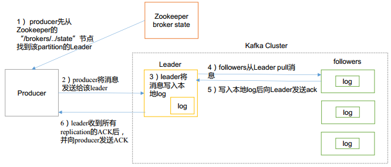
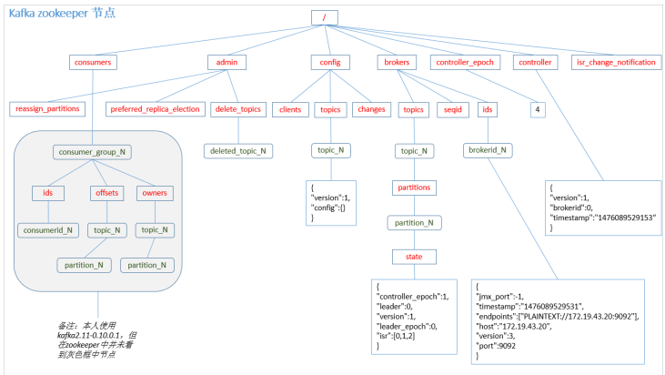

# 是什么

分布式的流平台

# 能干啥

三个关键能力：

​	1.发布订阅消息（流），类似一个消息队列或者企业消息系统

​	2.以容错的方式存储消息（流）

​	3.在消息流发生时处理

应用于两大类应用

​	1.构建实时的流数据管道，可靠的获取系统和应用程序之间的数据

​	2.构建实时流的应用程序，对数据流进行转换或反应

四个核心的api

​	producer api：发布消息到一个或多个topic

​	consumer api：订阅一个或多个的topic，来处理产生的消息

​	streams api：充当一个流处理器，从1个或多个topic消费输入流，并生产一个输出流到1个或多个输出topic，有效地将输入流转换到输出流。

​	connector api：允许构建或运行可重复使用的生产者或消费者，将topic连接到现有的应用程序或数据系统。例如，一个关系数据库的连接器可捕获每一个变化。


# 基本组成

## topic

消息的类型，好比说新闻的类别：体育、娱乐。。

- Topic是Kafka数据写入操作的基本单元，可以指定副本

- 一条消息有且只能属于一个topic


## Partition

分区，真正存储消息的区域，每一个分区都是一个顺序的不可变的消息队列，而且可以持续的添加。分区中的消息都有一个序列号（offset），在每个分区中的都是唯一的

一个topic中可以有多个Partition，在创建topic时可以指定任意数量的Partition

和topic关系如图所示


分区的原因：

​	一是可以处理更多的消息，不受单台服务器的限制。Topic拥有多个分区意味着它可以不受限的处理更多的数据

​	二分区可以作为并行处理的单元,提高并发能力

## producer

消息的产生者，消息由producer将指定topic的消息推送到服务器

## consumers

消费者组，消费者组中的consumer从kafka服务器中拉取数据并进行处理


设计思想：

传统的消息两种模型：队列、发布-订阅，队列是指一组消费者读取数据，这样一个消息只能由一个消费者处理，发布订阅形式可以保证消息能被所有的订阅的消费者收到

## broker

已发布的消息保存在一组服务器中，称之为Kafka集群，而一个服务器成为代理（broker），consumer从broker中订阅拉取消息，一个topic可以在集群中的多个broker中分布

## broker和topic和partition


如图所示同一个topic分布在不同的broker中，保证了kafka的容灾性，而一个topic又可以有指定数量的partition根据一定的分配规则均匀分布在不同的broker下的topic中，实现负载均衡，而一个broker中一个topic有一个leader（图中标红部分）

# 工作流程

## 推送消息

1.消息的生产者先根据需要推送消息的topic找到该所属partition中的leader，建立数据连接通道

2.向leader中传输数据，并写入本地partition log中

3.所属partition中剩下的follower从leader中拉取数据进行更新，写入本地log

4.在follower数据更新完成之后回馈leader ack

5.leader 收到所有 ISR 中的 replication 的 ACK 后，增加 HW（high watermark，最后 commit
的 offset）并向 producer 发送 ACK 



## 订阅消息

consumer想要订阅消息时会从指定topic中的partition中拉取消息，不同的消费者会在log中记录不同的offset，由消费者自己记录消费状态，每个消费者互相独立地顺序读取每个分区的消息，这种由消费者自由控制偏移量的优势在于灵活读取数据，一般来说数据的offset是随消费者读取数据而线性增加的，假设当消费者读取任意指定的数据时只要改变offset即可


# 集群模型


如图所示kafka中所有的分区读写操作都是leader分区

## zookeeper在kafka集群中作用

Apache Kafka的一个关键依赖是Apache Zookeeper，它是一个分布式配置和同步服务。 Zookeeper是Kafka代理和消费者之间的协调接口。 Kafka服务器通过Zookeeper集群共享信息。 Kafka在Zookeeper中存储基本元数据，例如关于主题，代理，消费者偏移(队列读取器)等的信息。

由于所有关键信息存储在Zookeeper中，并且它通常在其整体上复制此数据，因此Kafka代理/ Zookeeper的故障不会影响Kafka集群的状态。 Kafka将恢复状态，一旦Zookeeper重新启动。 这为Kafka带来了零停机时间。 Kafka代理之间的领导者选举也通过使用Zookeeper在领导者失败的情况下完成。

zookeeper存储大致如下



# 和传统的消息系统相比较不同

## 概念上区别

传统的消息分为两种方式：队列、订阅

队列模式：指一组消费者读取瓜分数据，这样一个消息只能由一个消费者处理

​	优点：方便进行扩展处理

​	缺点：如果消息读取程序故障，容易造成已读取数据的丢失

订阅模式：消息广播给所有的消费者，可以保证消息能被所有的订阅的消费者收到

​	优点：数据保存完好性

​	缺点：因为每个消费者都收到同样的数据，没法做数据的缩放处理

而kafka是采用的消费者组概念，既应用了队列又应用了发布订阅，一个消费者组中不同的消费者是队列形式，而不同的消费者组是采用的发布订阅模式，不同的消费者组收到消息是一样的

## kafka保证了更强的顺序性

传统的消息系统按顺序保存数据，如果多个消费者从队列消费，则服务器按存储的顺序发送消息，但是，尽管服务器按顺序发送，消息异步传递到消费者，因此消息可能乱序到达消费者。这意味着消息存在并行消费的情况，顺序就无法保证。消息系统常常通过仅设1个消费者来解决这个问题，但是这意味着没用到并行处理。

kafka做的更好。通过并行topic的parition —— kafka提供了顺序保证和负载均衡。**每个partition仅由同一个消费者组中的一个消费者消费到。并确保消费者是该partition的唯一消费者**，并按顺序消费数据。每个topic有多个分区，则需要对多个消费者做负载均衡，但请注意，相同的消费者组中不能有比分区更多的消费者，否则多出的消费者一直处于空等待，不会收到消息。

一个消费者如果接收了一个partition中的消息，那么会在接下去的数据处理中固定消费该partition中的消息，因为要维护offset。


# kafka如何保证数据一致性

## 数据同步机制（ISR）

ISR(in-sync-replica)，kafka数据同步采用的机制

上文中消息推送的最后一步是leader需要等待其所有的followers都发送ack之后再向producer返回ack

1. leader会维护一个与其基本保持同步的Replica列表，该列表称为ISR(in-sync Replica)，每个Partition都会有一个ISR，而且是由leader动态维护 
2. 如果一个flower比一个leader落后太多，或者超过一定时间未发起数据复制请求，则leader将其重ISR中移除 
3. 当ISR中所有Replica都向Leader发送ACK时，leader才commit
leader挂掉了，从它的follower中选举一个作为leader，并把挂掉的leader从ISR中移除，继续处理数据。一段时间后该leader重新启动了，它知道它之前的数据到哪里了，尝试获取它挂掉后leader处理的数据，获取完成后它就加入了ISR。

# kafka如何保证容灾能力

## 选主机制

kafka中partition的leader是由controller决定的

选取controller策略

1.当前每个broker都会在controller path(/controller)中创建一个watch

2.如果一旦controller出现问题，就会删除此controller path数据，此时该watch就会被fire，所有的broker都会去创建新的controller path，但是只有一个会成功

3.创建成功即为新的controller，失败的broker需要在新的controller中重新注册watch

选取leader partition策略

- 从Zookeeper中读取当前分区的所有ISR(in-sync replicas)集合
- 调用配置的分区选择算法选择分区的leader


# 安装部署

## 安装部署zookeeper

1.从[官网](http://www.apache.org/dyn/closer.cgi/zookeeper/)下载zookeeper的jar包，并解压

2.将解压后的目录作为$ZOOKEEPER_HOME，将/conf文件夹下的zoo_sample.cfg拷贝一份并且更名为zoo.cfg,修改其中内容

```sh
# 客户端和服务端之间的心跳间隔时间
tickTime=2000
# 集群中的follower服务器(F)与leader服务器(L)之间初始连接时能容忍的最多心跳数（tickTime的数量）。
initLimit=10
#集群中flower服务器（F）跟leader（L）服务器之间的请求和答应最多能容忍的心跳数
syncLimit=5
#数据存储目录(一般修改这个)
dataDir=/home/zookeeper/data
# 端口号
clientPort=2181
# 最大连接数
#maxClientCnxns=60
# The number of snapshots to retain in dataDir
#autopurge.snapRetainCount=3
# Purge task interval in hours
# Set to "0" to disable auto purge feature
#autopurge.purgeInterval=1
```

3.启动zookeeper

```shell
$ZOOKEEPER_HOME/bin/zkServer.sh start
#关闭
$ZOOKEEPER_HOME/bin/zkServer.sh stop
#重启
$ZOOKEEPER_HOME/bin/zkServer.sh restart
```

## 安装部署kafka

1.[官网](http://kafka.apache.org/downloads.html)下载kafka文件(注意带有src的是源文件)，解压

2.修改$KAFKA_HOME/conf/server.properties文件配置

```sh
############################# Server Basics #############################

# broker代理的唯一标识，如果单机模式不用修改
broker.id=0

############################# Socket Server Settings #############################

# The address the socket server listens on. It will get the value returned from 
# java.net.InetAddress.getCanonicalHostName() if not configured.
#   FORMAT:
#     listeners = listener_name://host_name:port
#   EXAMPLE:
#     listeners = PLAINTEXT://your.host.name:9092
#listeners=PLAINTEXT://:9092

# Hostname and port the broker will advertise to producers and consumers. If not set, 
# it uses the value for "listeners" if configured.  Otherwise, it will use the value
# returned from java.net.InetAddress.getCanonicalHostName().
#advertised.listeners=PLAINTEXT://your.host.name:9092

# Maps listener names to security protocols, the default is for them to be the same. See the config documentation for more details
#listener.security.protocol.map=PLAINTEXT:PLAINTEXT,SSL:SSL,SASL_PLAINTEXT:SASL_PLAINTEXT,SASL_SSL:SASL_SSL

# 接收响应请求的线程数量
num.network.threads=3

# 磁盘io线程数量
num.io.threads=8

# socket发送缓冲区大小
socket.send.buffer.bytes=102400

# socket接收缓冲区大小
socket.receive.buffer.bytes=102400

# socket请求的数据最大值
socket.request.max.bytes=104857600


############################# Log Basics #############################

# kafka的topic、partition数据（一般修改这个就行，也可以不修改）
log.dirs=/tmp/kafka-logs

# 默认分区数量
num.partitions=1

# 每个数据目录中的线程数，用于在启动时日志恢复，并在关闭时刷新。
num.recovery.threads.per.data.dir=1

############################# Internal Topic Settings  #############################
#对于除了开发测试之外的其他任何东西，group元数据内部主题的复制因子“__consumer_offsets”和“__transaction_state”，建议值大于1，以确保可用性(如3)
offsets.topic.replication.factor=1
transaction.state.log.replication.factor=1
transaction.state.log.min.isr=1

############################# Log Flush Policy #############################

# 消息直接被写入文件系统，但是默认情况下我们仅仅调用fsync()以延迟的同步系统缓存
# 这些有一些重要的权衡
# 1. 持久性:如果不使用复制，未刷新的数据可能会丢失。
# 2. 延迟:非常大的刷新间隔可能会在刷新时导致延迟，因为将会有大量数据刷新。
# 3. 吞吐量:刷新通常是最昂贵的操作，而一个小的刷新间隔可能会导致过多的搜索。
# 下面的设置允许你去配置刷新策略，每隔一段时间刷新或者一次N个消息（或者两个都配置）。这可以在全局范围内完成，并在每个主题的基础上重写。 every N messages (or both). This can be done globally and overridden on a per-topic basis.

# 在强制刷新数据到磁盘内允许接收消息的数量
#log.flush.interval.messages=10000

# 在强制刷新之前，消息可以在日志中停留的最长时间
#log.flush.interval.ms=1000

############################# Log Retention Policy #############################
# 日志文件保留时间
log.retention.hours=168

#日志文件保留的最大数据量
#和上一个. log.retention.hours 参数配置形成日志保留策略，如果满足其中之一条件日志删除
#log.retention.bytes=1073741824

# kafka分区从操作系统角度看就是一堆的segment文件，这里指segment文件限制的最大数据量大小
log.segment.bytes=1073741824

# 检查文件大小的间隔
log.retention.check.interval.ms=300000

############################# Zookeeper #############################

# 如果是远程zookeeper需要修改
zookeeper.connect=localhost:2181

# 连接超时等待时间
zookeeper.connection.timeout.ms=6000


############################# Group Coordinator Settings #############################

# The following configuration specifies the time, in milliseconds, that the GroupCoordinator will delay the initial consumer rebalance.
# The rebalance will be further delayed by the value of group.initial.rebalance.delay.ms as new members join the group, up to a maximum of max.poll.interval.ms.
# The default value for this is 3 seconds.
# We override this to 0 here as it makes for a better out-of-the-box experience for development and testing.
# However, in production environments the default value of 3 seconds is more suitable as this will help to avoid unnecessary, and potentially expensive, rebalances during application startup.
group.initial.rebalance.delay.ms=0
```


3.启动kafka

```shell
#客户端模式，一旦退出停止运行
./kafka-server-start.sh ../config/server.properties
#后台运行模式
nohup ./bin/kafka-server-start.sh ./config/server.properties > /dev/null 2>&1 &
```

## kafka相关api操作

在$KAFKA_HOME目录下存放了很多*.sh文件，kafka就是依靠这些文件进行api操作

### topic增删改查

```shell
#增加指定的topic

#zookeeper 				代表zookeeper的地址
#replication-factor 	分区副本的个数
#partitions				分区的数量
#topic					topic的命名
./bin/kafka-topics.sh --create \
--zookeeper localhost:2181 \
--replication-factor 1 \
--partitions 2 \
--topic hgf

#查看topic的信息

#查看所有的topic列表
./bin/kafka-topics.sh --zookeeper localhost:2181 --list
#查看指定的topic信息
./bin/kafka-topics.sh --zookeeper localhost:2181 --describe --topic hgf

#删除topic
#1.在kafka中标记此topic被删除(没有被彻底删除)
./bin/kafka-topics  --delete --zookeeper 192.168.100.1:2181  --topic  hgf
#2.删除kafka中关于此topic的所有数据
#打开之前在server.properties中的log日志存放目录	
cd /tmp/kafka-logs/
rm -rf hgf-*/
#3.删除此topic在zookeeper中的存储信息
$ZOOKEEPER_HOME/zkCli.sh 
rmr /brokers/topics/【topic name】

#修改topic相关属性
#分区数量只能增加不能减少
kafka-topics.sh  --alter --zookeeper  shb01:2181 --topic hgf --partition 3
```

### 消息的推送和消费

```shell
#推送消息到指定的topic
#broker-list broker代理集群的地址，多个用,相隔
 ./bin/kafka-console-producer.sh --broker-list localhost:9092 --topic hgf

#消费指定的消息
./bin/kafka-console-consumer.sh \
--bootstrap-server localhost:9092 \
--topic hgf \
--from-beginning
```

