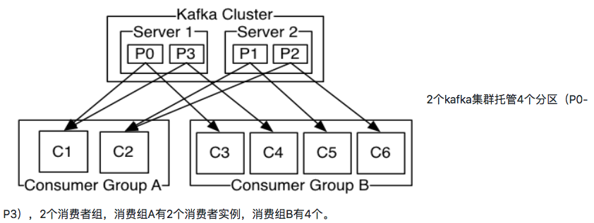

# 是什么

分布式的流平台

# 能干啥

三个关键能力：

​	1.发布订阅消息（流），类似一个消息队列或者企业消息系统

​	2.以容错的方式存储消息（流）

​	3.在消息流发生时处理

应用于两大类应用

​	1.构建实时的流数据管道，可靠的获取系统和应用程序之间的数据

​	2.构建实时流的应用程序，对数据流进行转换或反应

四个核心的api

​	producer api：发布消息到一个或多个topic

​	consumer api：订阅一个或多个的topic，来处理产生的消息

​	streams api：充当一个流处理器，从1个或多个topic消费输入流，并生产一个输出流到1个或多个输出topic，有效地将输入流转换到输出流。

​	connector api：允许构建或运行可重复使用的生产者或消费者，将topic连接到现有的应用程序或数据系统。例如，一个关系数据库的连接器可捕获每一个变化。


# 基本组成

## topic

消息的类型，好比说新闻的类别：体育、娱乐。。

- Topic是Kafka数据写入操作的基本单元，可以指定副本

- 一条消息有且只能属于一个topic


## Partition

分区，真正存储消息的区域，每一个分区都是一个顺序的不可变的消息队列，而且可以持续的添加。分区中的消息都有一个序列号（offset），在每个分区中的都是唯一的

一个topic中可以有多个Partition，在创建topic时可以指定任意数量的Partition

和topic关系如图所示


分区的原因：

​	一是可以处理更多的消息，不受单台服务器的限制。Topic拥有多个分区意味着它可以不受限的处理更多的数据

​	二分区可以作为并行处理的单元,提高并发能力

## producer

消息的产生者，消息由producer将指定topic的消息推送到服务器

## consumers

消费者组，消费者组中的consumer从kafka服务器中拉取数据并进行处理



设计思想：

传统的消息两种模型：队列、发布-订阅，队列是指一组消费者读取数据，这样一个消息只能由一个消费者处理，发布订阅形式可以保证消息能被所有的订阅的消费者收到

## broker

已发布的消息保存在一组服务器中，称之为Kafka集群，而一个服务器成为代理（broker），consumer从broker中订阅拉取消息，一个topic可以在集群中的多个broker中分布

## broker和topic和partition


如图所示同一个topic分布在不同的broker中，保证了kafka的容灾性，而一个topic又可以有指定数量的partition根据一定的分配规则均匀分布在不同的broker下的topic中，实现负载均衡，而一个broker中一个topic有一个leader（图中标红部分）

# 工作流程

## 推送消息

1.消息的生产者先根据需要推送消息的topic找到该所属partition中的leader，建立数据连接通道

2.向leader中传输数据，并写入本地partition log中

3.所属partition中剩下的follower从leader中拉取数据进行更新，写入本地log

4.在follower数据更新完成之后回馈leader ack

5.leader收到所有follower的ack 之后向producer发送ack

## 订阅消息

consumer想要订阅消息时会从指定topic中的partition中拉取消息，不同的消费者会在log中记录不同的offset，由消费者自己记录消费状态，每个消费者互相独立地顺序读取每个分区的消息，这种由消费者自由控制偏移量的优势在于灵活读取数据，一般来说数据的offset是随消费者读取数据而线性增加的，假设当消费者读取任意指定的数据时只要改变offset即可


# 集群模型


如图所示kafka中所有的分区读写操作都是leader分区

# 和传统的消息系统相比较不同

## 概念上区别

传统的消息分为两种方式：队列、订阅

队列模式：指一组消费者读取瓜分数据，这样一个消息只能由一个消费者处理

​	优点：方便进行扩展处理

​	缺点：如果消息读取程序故障，容易造成已读取数据的丢失

订阅模式：消息广播给所有的消费者，可以保证消息能被所有的订阅的消费者收到

​	优点：数据保存完好性

​	缺点：因为每个消费者都收到同样的数据，没法做数据的缩放处理

而kafka是采用的消费者组概念，既应用了队列又应用了发布订阅，一个消费者组中不同的消费者是队列形式，而不同的消费者组是采用的发布订阅模式，不同的消费者组收到消息是一样的

## kafka保证了更强的顺序性

传统的消息系统按顺序保存数据，如果多个消费者从队列消费，则服务器按存储的顺序发送消息，但是，尽管服务器按顺序发送，消息异步传递到消费者，因此消息可能乱序到达消费者。这意味着消息存在并行消费的情况，顺序就无法保证。消息系统常常通过仅设1个消费者来解决这个问题，但是这意味着没用到并行处理。

kafka做的更好。通过并行topic的parition —— kafka提供了顺序保证和负载均衡。**每个partition仅由同一个消费者组中的一个消费者消费到。并确保消费者是该partition的唯一消费者**，并按顺序消费数据。每个topic有多个分区，则需要对多个消费者做负载均衡，但请注意，相同的消费者组中不能有比分区更多的消费者，否则多出的消费者一直处于空等待，不会收到消息。

一个消费者如果接收了一个partition中的消息，那么会在接下去的数据处理中固定消费该partition中的消息，因为要维护offset。

# zookeeper在kafka集群中作用

Apache Kafka的一个关键依赖是Apache Zookeeper，它是一个分布式配置和同步服务。 Zookeeper是Kafka代理和消费者之间的协调接口。 Kafka服务器通过Zookeeper集群共享信息。 Kafka在Zookeeper中存储基本元数据，例如关于主题，代理，消费者偏移(队列读取器)等的信息。

由于所有关键信息存储在Zookeeper中，并且它通常在其整体上复制此数据，因此Kafka代理/ Zookeeper的故障不会影响Kafka集群的状态。 Kafka将恢复状态，一旦Zookeeper重新启动。 这为Kafka带来了零停机时间。 Kafka代理之间的领导者选举也通过使用Zookeeper在领导者失败的情况下完成。

# 安装部署

## 安装部署zookeeper

1.从[官网](http://www.apache.org/dyn/closer.cgi/zookeeper/)下载zookeeper的jar包，并解压

2.将解压后的目录作为$ZOOKEEPER_HOME，将/conf文件夹下的zoo_sample.cfg拷贝一份并且更名为zoo.cfg,修改其中内容

```sh
# 客户端和服务端之间的心跳间隔时间
tickTime=2000
# 集群中的follower服务器(F)与leader服务器(L)之间初始连接时能容忍的最多心跳数（tickTime的数量）。
initLimit=10
#集群中flower服务器（F）跟leader（L）服务器之间的请求和答应最多能容忍的心跳数
syncLimit=5
#数据存储目录(一般修改这个)
dataDir=/home/zookeeper/data
# 端口号
clientPort=2181
# 最大连接数
#maxClientCnxns=60
# The number of snapshots to retain in dataDir
#autopurge.snapRetainCount=3
# Purge task interval in hours
# Set to "0" to disable auto purge feature
#autopurge.purgeInterval=1
```

3.启动zookeeper

```shell
$ZOOKEEPER_HOME/bin/zkServer.sh start
#关闭
$ZOOKEEPER_HOME/bin/zkServer.sh stop
#重启
$ZOOKEEPER_HOME/bin/zkServer.sh restart
```

## 安装部署kafka

1.[官网](http://kafka.apache.org/downloads.html)下载kafka文件(注意带有src的是源文件)，解压

2.修改$KAFKA_HOME/conf/server.properties文件配置

```sh
############################# Server Basics #############################

# broker代理的唯一标识，如果单机模式不用修改
broker.id=0

############################# Socket Server Settings #############################

# The address the socket server listens on. It will get the value returned from 
# java.net.InetAddress.getCanonicalHostName() if not configured.
#   FORMAT:
#     listeners = listener_name://host_name:port
#   EXAMPLE:
#     listeners = PLAINTEXT://your.host.name:9092
#listeners=PLAINTEXT://:9092

# Hostname and port the broker will advertise to producers and consumers. If not set, 
# it uses the value for "listeners" if configured.  Otherwise, it will use the value
# returned from java.net.InetAddress.getCanonicalHostName().
#advertised.listeners=PLAINTEXT://your.host.name:9092

# Maps listener names to security protocols, the default is for them to be the same. See the config documentation for more details
#listener.security.protocol.map=PLAINTEXT:PLAINTEXT,SSL:SSL,SASL_PLAINTEXT:SASL_PLAINTEXT,SASL_SSL:SASL_SSL

# The number of threads that the server uses for receiving requests from the network and sending responses to the network
num.network.threads=3

# The number of threads that the server uses for processing requests, which may include disk I/O
num.io.threads=8

# The send buffer (SO_SNDBUF) used by the socket server
socket.send.buffer.bytes=102400

# The receive buffer (SO_RCVBUF) used by the socket server
socket.receive.buffer.bytes=102400

# The maximum size of a request that the socket server will accept (protection against OOM)
socket.request.max.bytes=104857600


############################# Log Basics #############################

# kafka的topic、partition数据（一般修改这个就行，也可以不修改）
log.dirs=/tmp/kafka-logs

# 默认分区数量
num.partitions=1

# The number of threads per data directory to be used for log recovery at startup and flushing at shutdown.
# This value is recommended to be increased for installations with data dirs located in RAID array.
num.recovery.threads.per.data.dir=1

############################# Internal Topic Settings  #############################
# The replication factor for the group metadata internal topics "__consumer_offsets" and "__transaction_state"
# For anything other than development testing, a value greater than 1 is recommended for to ensure availability such as 3.
offsets.topic.replication.factor=1
transaction.state.log.replication.factor=1
transaction.state.log.min.isr=1

############################# Log Flush Policy #############################

# Messages are immediately written to the filesystem but by default we only fsync() to sync
# the OS cache lazily. The following configurations control the flush of data to disk.
# There are a few important trade-offs here:
#    1. Durability: Unflushed data may be lost if you are not using replication.
#    2. Latency: Very large flush intervals may lead to latency spikes when the flush does occur as there will be a lot of data to flush.
#    3. Throughput: The flush is generally the most expensive operation, and a small flush interval may lead to excessive seeks.
# The settings below allow one to configure the flush policy to flush data after a period of time or
# every N messages (or both). This can be done globally and overridden on a per-topic basis.

# The number of messages to accept before forcing a flush of data to disk
#log.flush.interval.messages=10000

# The maximum amount of time a message can sit in a log before we force a flush
#log.flush.interval.ms=1000

############################# Log Retention Policy #############################

# The following configurations control the disposal of log segments. The policy can
# be set to delete segments after a period of time, or after a given size has accumulated.
# A segment will be deleted whenever *either* of these criteria are met. Deletion always happens
# from the end of the log.

# 日志文件保留时间
log.retention.hours=168

# A size-based retention policy for logs. Segments are pruned from the log unless the remaining
# segments drop below log.retention.bytes. Functions independently of log.retention.hours.
#log.retention.bytes=1073741824

# The maximum size of a log segment file. When this size is reached a new log segment will be created.
log.segment.bytes=1073741824

# The interval at which log segments are checked to see if they can be deleted according
# to the retention policies
log.retention.check.interval.ms=300000

############################# Zookeeper #############################

# 如果是远程zookeeper需要修改
zookeeper.connect=localhost:2181

# 连接超时等待时间
zookeeper.connection.timeout.ms=6000


############################# Group Coordinator Settings #############################

# The following configuration specifies the time, in milliseconds, that the GroupCoordinator will delay the initial consumer rebalance.
# The rebalance will be further delayed by the value of group.initial.rebalance.delay.ms as new members join the group, up to a maximum of max.poll.interval.ms.
# The default value for this is 3 seconds.
# We override this to 0 here as it makes for a better out-of-the-box experience for development and testing.
# However, in production environments the default value of 3 seconds is more suitable as this will help to avoid unnecessary, and potentially expensive, rebalances during application startup.
group.initial.rebalance.delay.ms=0
```


