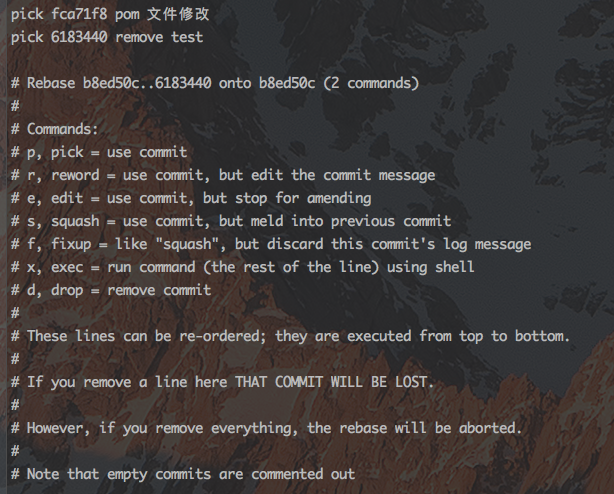
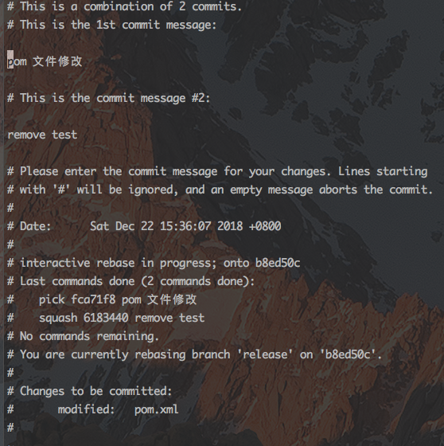

# git 入门

》》1.新建git仓库
​		cd 			打开一个文件夹
​		mkdir 		新建一个文件夹
​		cd ../		返回上一级
​		git init 	将当前目录变成git仓库，
​						并在当前目录下会新建.git文件夹，切记不可乱改 ！！！！！！！！！
​		ls 			显示当前目录下的所有文件（不包括.git）
​		pwd 		显示当前目录结构


》》2.新建文件
​		touch 文件名.格式

​		
》》3.查看修改文件
​	cat 文件名.格式		查看文件
​	vim 文件名.格式		进入文件编辑
​	
​	按i键进入插入模式
​	在编辑完之后一定要按esc退出
​	
	:wq						命令强制保存并退出
	
	git add./git add --all	将所有文件保存在缓存区中
	git add 文件名.格式 	文件保存在缓存区中
	git commit -m "文件注释方便以后查看"  提交

》》4.撤销回退
​	git log						显示修改日志
​	git reflog 					显示修改记录过后的版本号
​	git reset --hard HEAD^		回退上个版本
​	git reset --hard 版本号 	回退指定版本号
​	git rm --cached 文件路径	将文件从缓冲区撤下，但是不删除物理文件
​	git rm --f 文件路径			不仅删除物理文件还删除缓冲区中文件

》》》》》》其他
​	git status 		查看文件的状态

					1.表示修改完还没有提交
						Changes to be committed:
						(use "git reset HEAD <file>..." to unstage)
							modified:   aa.txt
					
					2.表示文件没有处于监听状态：可能刚创建没有做任何操作
						On branch master
						Untracked files:
						(use "git add <file>..." to include in what will be committed)
	
						cc.txt
	
						nothing added to commit but untracked files present (use "git add" to track)

》》》》二、远程连接GitHub

	1.ssh-keygen -t rsa –C "'hgftest@126.com'" 在本地注册了key，也就是在/user/.ssh中生成
		两个文件：..rsa，rsa_pub，注意字符串之间的间隔注意字符串之间的间隔
		会出现：
		Generating public/private rsa key pair.
		Enter file in which to save the key (/c/Users/Administrator/.ssh/id_rsa):（此时按三下空格，不设密码）
		Enter passphrase (empty for no passphrase):
		Enter same passphrase again:
		Your identification has been saved in /c/Users/Administrator/.ssh/id_rsa.
		Your public key has been saved in /c/Users/Administrator/.ssh/id_rsa.pub.
		The key fingerprint is:
		SHA256:H880bqASBr/dNEenLjjgQ+6iYmQKasJhHAqtICYoUUU hgftest@126.com
		The key's randomart image is:
		+---[RSA 2048]----+
		| ..oE            |
		|.                |
		|.o  .       . .  |
		|Bo.  o     . o   |
		|X..   * S = =    |
		|+*   = = * @ .   |
		|O .   * = + *    |
		|=+  .. o . o     |
		|+... ..          |
		+----[SHA256]-----+

​		

	2.复制rsa_pub中的代码
	
	3.在github中新建生成key，将复制的代码拷贝
	
		ssh -T git@github.com
		可测试是否创建成功
		
	4.$ git remote add origin https://github.com/githgf/learngit.git
	
	5.git pull --rebase origin master 
		同步代码库，生成readme文件
		
	6.git push -u origin master


》》克隆数据库
​		$ git clone https://github.com/githgf/gitskill

》》上传文件到github
​	
​		1.将当前目录文件初始化
​		git init
​		2.将当前目录文件加到暂存区
​		git add .
​		3.提交文件到本地git仓库
​		git commit -m "first commit"
​		4.连接github
​		 git remote add origin https://github.com/githgf/learngit.git
​		5.新建readme.md 文件（github要求）第一次提交才会用
​		git pull --rebase origin master 
​		6.上传
​		git push origin master


	下载分支代码
		git clone -b xxx url


​	
​	下载主分支代码并切换到分支
​		git init
​		git remote add origin（本地远程分支） http://code.gomrwind.com/windforce-java/delivery.git
​		git pull
​		git checkout -b hotfix-v0.0.3(本地分支名) origin/hotfix-v0.0.3（远程分支名）
# 具体操作

## 版本回退

        git reset --soft head               保存本地代码并回退上个版本
        git reset --hard head^              不保存本地，强行回退上个版本

## 将本地代码推送到远程
```shell
在本地创建分支并切换
	git checkout -b branchName
推送代码：	
	git push origin localBranchName:originBranchName(本地分支名：远程分支名)
```


## 分支操作

```shell
#创建并切换本地分支为要创建的远程分支名
git checkout -b newName
#提交代码
git push -u origin newName

这样就会在远程仓库建立名为newName的远程分支

#更新远程分支列表
git remote update origin --prune
#删除远程分支
git push --delete origin {分支名}
```

## 分支合并

场景：假设现在存在两只本地分支，dev是从work的b节点切出来的，现在其他人在work分支修改并提交，那么我们想将work中最新代码合并到dev

```shell
      d - e (dev)   
    /    
a - b - c - f(work)
```

### merge

```shell
git checkout dev
git merge work
#之后的分支线如下
      d - e (dev)  -   
    /     			 \
a - b - c - f(work) - g(merge...)
#merge之后的线将合并细节展示的很清楚
```


### rebase

```shell
git checkout dev
git rebase work
#这之后分支线如下
a - b - c - f(work) - d - e(dev)
#rebase之后分支线更加的清晰，
```

在merge和rebase的时候有时需要解决冲突，在解决完冲突之后需要

git rebase(merge) --continue

如果撤销此次合并，直接git rebase(merge) --abort


## commit 

```sh
#对上一次的提交修改
#当我们想要对上一次的提交进行修改时，我们可以使用git commit –amend命令。git commit –amend既可以对上次提交的内容进行修改，也可以修改提交说明。
#--no-edit 配合–amend表示修改提价但不修改提交的信息
git commit --amend --no-edit

```


## 案例：

情景一：本地代码更新时本地代码没有提交，发生合并错误，但是现在本地代码不想提交到远程

解决：
方案一：

```shell
#1.先提交本地代码到本地，
git add .
git commit -m "tmp"
#2. 版本回退到本地最新的提交
git reset --hard HEAD~1
#3.合并本地代码和远程最新代码
git pull
#4.获取本地最后一次提交的代码记录,并进行更新
git cherry-pick b1b360ec54b0a9b795110cefcadca9345dbba44b
#5.回退上次提交到本地的代码
git reset --soft HEAD~1
#--soft是指代码不会撤销，只是提交的记录撤销
```

方案二：

```shell
#1.先用fetch拉取远程的代码
git fetch origin dev
#2.将本地的不想提交的代码保存在储存栈中
git stash save "save tmp"
#3.合并远程分支和本地代码
git merage origin/dev 
#4.从存储栈中拿出本地的临时储存
git stash pop

```

情景二：将本地多次的commit提交为

现在有一个本地分支提交记录(git log)如下：

```shell
commit 61834402b96cd6bbb170aaeb40a8c37ff0af1c37 (HEAD -> release)
Author: linsen <linsen@123feng.com>
Date:   Sat Dec 22 15:55:29 2018 +0800

    remove test

commit fca71f8b7314bf45b2ad34253bca8adcebc8f600
Author: linsen <linsen@123feng.com>
Date:   Sat Dec 22 15:36:07 2018 +0800

    pom 文件修改

commit b8ed50c907e432f6deef8563c6e2eb64a9a810fe (origin/release)
Author: linsen <linsen@123feng.com>
Date:   Sat Dec 15 20:16:19 2018 +0800

    excel增加计费单位字段


#现在需要将 pom 文件修改<test>，pom 文件修改<message> 合并为一个提交记录
git rebase -i <commitId>
#这里的commitId是指在指定 commitId 之前的commit合并为一个，所以我们这里选择b8ed50c907e432f6deef8563c6e2eb64a9a810fe(也就是最后一个)
#步骤如下：
git rebase -i fca71f8b7314bf45b2ad34253bca8adcebc8f603
#此时会出现一个界面
```



```
- pick 		使用本次提交
- reword 	使用本次提交，但是修改提交的信息
- edit		使用本次提交，但是停止修改
- squash	使用本次提交，但是合并到上一个提交
- fixup		和squash类似，但是放弃提交的信息
- drop		删除此次提交(如果当前的commit不想要，就可用这种方式)

很显然我们这里需要将 6183440 的提交记录修改为 squash
pick fca71f8 pom 文件修改
squash 6183440 remove test

保存退出

此时显示如下界面
```



```markdown
#这里只需要显示最后暴露的commit信息即可，其余都可以注释
保存退出

最后git log显示如下
commit 110b8a1ef55a7df426bcc68aefada15ff35d31da (HEAD -> release)
Author: linsen <linsen@123feng.com>
Date:   Sat Dec 22 15:36:07 2018 +0800

    pom 文件修改

commit b8ed50c907e432f6deef8563c6e2eb64a9a810fe (origin/release)
Author: linsen <linsen@123feng.com>
Date:   Sat Dec 15 20:16:19 2018 +0800

    excel增加计费单位字段

```

## 各种撤销

###撤销已经commit到本地，但是不想push

```shell
	git reset --soft HEAD~1
```
###撤销add文件

```shell
	git reset HEAD <file>
```

## git pull和git fetch 区别

git fetch 会拉取指定分支上的代码不会自动合并
git pull  会拉取代码然后进行自动merage合并


