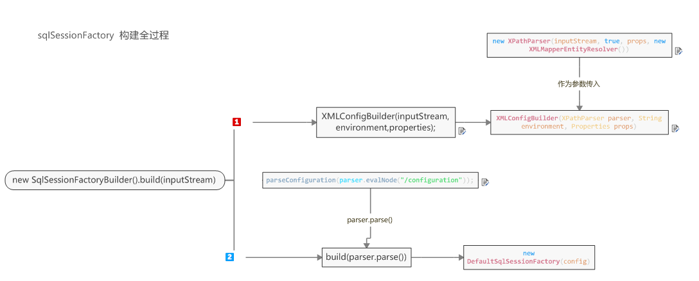

# 源码解析：

## 重要类解析

### MetaObject

### MetaClass

### ObjectWrapper

### StatementHandler

接口定义

```java
public interface StatementHandler {
  Statement prepare(Connection connection)
      throws SQLException;
  void parameterize(Statement statement)
      throws SQLException;
  void batch(Statement statement)
      throws SQLException;
  int update(Statement statement)
      throws SQLException;
  <E> List<E> query(Statement statement, ResultHandler resultHandler)
      throws SQLException;
  BoundSql getBoundSql();
  ParameterHandler getParameterHandler();
}

```

实现的接口

BaseStatementHandler,直接实现

RoutingStatementHandler，直接实现，这是一个封装类，它不提供具体的实现，只是根据Executor的类型，创建不同的类型StatementHandler。

SimpleStatementHandler，这个类对应于JDBC的Statement对象，用于没有预编译参数的SQL的运行。

PreparedStatementHandler 这个用于预编译参数SQL的运行。

CallableStatementHandler 它将实存储过程的调度。


## 过程解析

### 1.创建SqlSessionFactory时环境准备

[可以借鉴博客](https://www.cnblogs.com/cookiezhi/p/6267109.html)

ps:测试用例是用mybatis-config.xml做配置文件，还有种方法是直接构建（官网）

1.1构建文件解析器

```java
new SqlSessionFactoryBuilder().build(inputStream)

XMLConfigBuilder parser = new XMLConfigBuilder(inputStream, environment, properties);

this
  (
  new XPathParser(inputStream, true, props, new XMLMapperEntityResolver()), 
  environment, props
  );

```

1.2.对环境xml文件相应各个节点解析

> ```java
> propertiesElement(root.evalNode("properties"));
> 对<properties></properties>进行解析，将resource和url节点中的值存入configuration中Variables
> 注意，这里resource和url节点不能同时存在
>
> Properties settings = settingsAsProperties(root.evalNode("settings"));
> 对<settings></settings>节点进行解析，返回的节点属性集合
>
> loadCustomVfs(settings);
> 对<settings>中 vfsImpl属性解析和配置（暂时不知道干啥的）
>
> typeAliasesElement(root.evalNode("typeAliases"));
> 对<typeAliases>节点解析，也就是全局的别名，同时对放在此节点的中的对象的@Alias注解获取值，全部存放在XMLConfigBuilder类的TypeAliasRegistry.TYPE_ALIASES 中
>
> pluginElement(root.evalNode("plugins"));
> 对<plugins>解析，存在XMLConfigBuilder中configuration中的interceptorChain
> http://www.mybatis.org/mybatis-3/zh/configuration.html#plugins
>
> objectFactoryElement(root.evalNode("objectFactory"));
> 对<objectFactory>解析，存在XMLConfigBuilder中configuration中的objectFactory（对象工厂）
> http://www.mybatis.org/mybatis-3/zh/configuration.html#objectFactory
>
> objectWrapperFactoryElement(root.evalNode("objectWrapperFactory"));
> 对<objectWrapperFactory>解析，存在XMLConfigBuilder中configuration中的objectWrapperFactory
>
> reflectorFactoryElement(root.evalNode("reflectorFactory"));
> 对<reflectorFactory>解析，存在XMLConfigBuilder中configuration中的reflectorFactory
>
> settingsElement(settings);
> 将之前setting节点的属性值集一个个设置到Configuration中的相对应的属性
> 属性的具体说明 http://www.mybatis.org/mybatis-3/zh/configuration.html#settings
>
> environmentsElement(root.evalNode("environments"));
> 对<environments>解析，存在XMLConfigBuilder中configuration中的environment
> 这其中还会对transactionManager、dataSource也会解析
> http://www.mybatis.org/mybatis-3/zh/configuration.html#environments
>
> databaseIdProviderElement(root.evalNode("databaseIdProvider"));
> 对<databaseIdProvider>解析，存在XMLConfigBuilder中configuration中的databaseId
> 也就是数据库厂商标识
>
> typeHandlerElement(root.evalNode("typeHandlers"));
> 类型处理器配置，javatype、jdbctype、
>
> mapperElement(root.evalNode("mappers"));
> 最后是mapper映射处理器，
> 首先判断
> 	在配置文件中如果指定了package，会将这个包下所有的接口类，加载到XMLConfigBuilder中configuration中mapperRegistry的knownMappers
> 	如果没有package，存在resource、url、class其中之一（注意只能是其中之一，一个mapper节点不能并存）进入下面判断
> 	--如果是class会把符合条件的接口类加载到XMLConfigBuilder中configuration中mapperRegistry的knownMappers（hashmap）
> 	--如果是resource，会调用XMLMapperBuilder.parse(),详情如下
>
> ```

XMLMapperBuilder.parse()

```java
if (!configuration.isResourceLoaded(resource)) {//查看是否已经解析过此mapper文件
//下文中对如何解析动态的sql语句有详细介绍   ------>   sql语句的动态封装
      configurationElement(parser.evalNode("/mapper"));
  			//设置命名空间
  			builderAssistant.setCurrentNamespace(namespace);
  			//设置缓存对象
      		cacheRefElement(context.evalNode("cache-ref"));
      		cacheElement(context.evalNode("cache"));
  			//将parameterMap配置在paramMaps
            parameterMapElement(context.evalNodes("/mapper/parameterMap"));
  				builderAssistant.buildParameterMapping（....）；
            //配置resultMap，放在resultMappering列表中
            resultMapElements(context.evalNodes("/mapper/resultMap"));
  			//解析公用sql语句，放在sqlFragments
            sqlElement(context.evalNodes("/mapper/sql"));
  			//将增删改查的sql语句放在configuration.incompleteStatements中,
            buildStatementFromContext(context.evalNodes("select|insert|update|delete"));
  
      configuration.addLoadedResource(resource);
  		//将mapper放在configuration中的mapper列表中
      bindMapperForNamespace();
    }
	
    parsePendingResultMaps();
    parsePendingCacheRefs();
    parsePendingStatements();
		//会调用configuration.addMappedStatement(statement），注意这里会存放sql语句*2数量的mappedStatement,一个sql语句存在  namespace+id   id  两种方式，如果存在sql语句的id重复，会覆盖
		builderAssistant.addMappedStatement()
```




[01]: D:\gitwork\myWork\myWork\studyLib\javaee\mybatis.mmap	"可见mmap文件"


### 2.创建sqlSession对象

​	openSession()  -->  openSessionFromDataSource(configuration.getDefaultExecutorType(), null, false)

```java
final Environment environment = configuration.getEnvironment();

final TransactionFactory transactionFactory =  getTransactionFactoryFromEnvironment(environment);                                    
tx = transactionFactory.newTransaction(environment.getDataSource(), level, autoCommit);
事务管理

final Executor executor = configuration.newExecutor(tx, execType);   
//mybatis的执行器（增删改查），有以下三个等级  SIMPLE, REUSE, BATCH
//注意这里不管创建那种执行器，其作为CachingExecutor的全局变量，
    private final Executor delegate;
    private final TransactionalCacheManager tcm = new TransactionalCacheManager();

    //这样再做增删改查之前可以先进行缓存的查询，如果有直接返回，没有的话在进行查询，然后将值放在缓存中，相当于一个aop环绕增强
return new DefaultSqlSession(configuration, executor, autoCommit);
在这首先会创建
```

### 3.执行增删改查

以sqlsession.selectList("namespace+sqlId",param);

```java
//从全局的configuration中的mappedStatments列表中根据namespace+sqlId或者sqlId找到mappedStatment,也就是映射处理
MappedStatement ms = configuration.getMappedStatement(statement);
//执行查询
return executor.query(ms, wrapCollection(parameter), rowBounds,Executor.NO_RESULT_HANDLER);
	//这里首先是执行CacheExecutor,
	//获取sql语句的封装体（paramMappings....）
	BoundSql boundSql = ms.getBoundSql(parameterObject);
	//查看当前一级缓存有没有
    CacheKey key = createCacheKey(ms, parameterObject, rowBounds, boundSql);
    return query(ms, parameterObject, rowBounds, resultHandler, key, boundSql);
		//这里会调用BaseExecutor.queryFromDatabase(...)
		//然后再调用SimpleExecutor.doQuery(...)
		//根据mappedStatment创建StatementHandler，调用PreparedStatementHandler.query（...）方法,在这里会将传入的Statment转为PreparedStatement，并将查询后的结果赋值其中
		ps.executor();
		//DefaultResultSetHandler.handleResultSets(Statment st),下文详解
```

DefaultResultSetHandler.handleResultSets(Statment st)

```java
方法主要内容：
	//把传入的st封装
	 ResultSetWrapper rsw = getFirstResultSet(stmt);
		ResultSet rs = stmt.getResultSet();
		new ResultSetWrapper(rs, configuration)
          super();
          this.typeHandlerRegistry = configuration.getTypeHandlerRegistry();
          this.resultSet = rs;
          final ResultSetMetaData metaData = rs.getMetaData();
          final int columnCount = metaData.getColumnCount();
          for (int i = 1; i <= columnCount; i++) {
          columnNames.add(configuration.isUseColumnLabel() ?
                        metaData.getColumnLabel(i) : metaData.getColumnName(i));
          jdbcTypes.add(JdbcType.forCode(metaData.getColumnType(i)));
          classNames.add(metaData.getColumnClassName(i));
    
	//获取结果集，也就是mapper文件中指定的<ResultMap>节点
    List<ResultMap> resultMaps = mappedStatement.getResultMaps();
while (rsw != null && resultMapCount > resultSetCount) {
      ResultMap resultMap = resultMaps.get(resultSetCount);
  //这是将结果装配到目标类中的方法,详情如下
      handleResultSet(rsw, resultMap, multipleResults, null);
      rsw = getNextResultSet(stmt);
      cleanUpAfterHandlingResultSet();
      resultSetCount++;
    }

//这里主要是java对象值引用，这里的multipleResults修改了，外部的multipleResults也会改变
 DefaultResultSetHandler.handleResultSet(rsw, resultMap, multipleResults, null);
	 if (resultHandler == null) {
          DefaultResultHandler defaultResultHandler = new 				        DefaultResultHandler(objectFactory);
       		//主要入口，主要在内部修改defaultResultHandler
          handleRowValues(rsw, resultMap, defaultResultHandler, rowBounds, null);
       		handleRowValuesForSimpleResultMap(....)
              		//详情如下
                  Object rowValue = getRowValue(rsw, discriminatedResultMap);
					
          multipleResults.add(defaultResultHandler.getResultList());
        } else {
          handleRowValues(rsw, resultMap, resultHandler, rowBounds, null);
        }

// getRowValue(rsw, discriminatedResultMap)
主要代码如下

//相当于创建一个结果封装对象，比如说查询结果是很多的员工，这里就是反射创建员工对象,下文详解
Object rowValue = createResultObject(rsw, resultMap, lazyLoader, null);

//个人理解这里就是将metaObject和rowValue指向同一个对象，
//也就是说改变了metaObject，rowValue也会改变
final MetaObject metaObject = configuration.newMetaObject(rowValue);
//这里是关键，就是将值设置到metaObject中
foundValues = applyPropertyMappings(rsw, resultMap, metaObject, lazyLoader, null) || foundValues;
	 Object value = 
       getPropertyMappingValue(rsw.getResultSet(), metaObject, propertyMapping, lazyLoader, columnPrefix);
			//返回单个结果，假设当前属性是int类型，那typeHandler就是IntegerTypeHandler
			typeHandler.getResult(rs, column)

```

4.补充：创建结果集对象

```java
以List<Employee>为例

//这里要生成Employee
Object rowValue = createResultObject(rsw, resultMap, lazyLoader, null);
中间再次调用
createResultObject(rsw, resultMap, constructorArgTypes, constructorArgs,  columnPrefix)
```

```java
	//employee 的class	
	final Class<?> resultType = resultMap.getType(); 
    final MetaClass metaType = MetaClass.forClass(resultType, reflectorFactory);
    final List<ResultMapping> constructorMappings = resultMap.getConstructorResultMappings();
	//如果存在结果集处理器
    if (hasTypeHandlerForResultObject(rsw, resultType)) {
      return createPrimitiveResultObject(rsw, resultMap, columnPrefix);
      
    } else if (!constructorMappings.isEmpty()) {
      return createParameterizedResultObject(rsw, resultType, constructorMappings, constructorArgTypes, constructorArgs, columnPrefix);
      
      ////当结果集对象（employee）存在无参的构造器，或者结果集是接口类型
    } else if (resultType.isInterface() || metaType.hasDefaultConstructor()) {
      return objectFactory.create(resultType);
      
      //是否应该使用结果集推断实例化对象，也就是根据结果集的字段，调用有参的构造器
    } else if (shouldApplyAutomaticMappings(resultMap, false)) {
      return createByConstructorSignature(rsw, resultType, constructorArgTypes, constructorArgs, columnPrefix);
    }

```

```java
createByConstructorSignature(rsw, resultType, constructorArgTypes, constructorArgs, columnPrefix);
》》》》》》代码如下
final Constructor<?>[] constructors = resultType.getDeclaredConstructors();
//看是否有autoMapConstructor注解的构造器
final Constructor<?> annotatedConstructor = findAnnotatedConstructor(constructors);
if (annotatedConstructor != null) {
  return createUsingConstructor(rsw, resultType, constructorArgTypes, constructorArgs, columnPrefix, annotatedConstructor);
} else {
  //调用有参构造器，看是否符合结果集要求
  for (Constructor<?> constructor : constructors) {
    if (allowedConstructor(constructor, rsw.getClassNames())) {
      return createUsingConstructor(rsw, resultType, constructorArgTypes, constructorArgs, columnPrefix, constructor);
    }
  }
}
》》》》》》》》》》》》》
createUsingConstructor(rsw, resultType, constructorArgTypes, constructorArgs, columnPrefix, constructor);
	这部分的代码就是，根据结果集调用符合条件的构造器，如果不存在，报错
```


4.通过接口查询，例如直接调用mapper.findById(..)

```java
MapperProxy
	通过jdk动态代理的方式，形成切面（sqlsession.getMapper(...)），然后最后还是会调用sqlsession.selectList || sqlsession.selectOne ...方法
	
```

## 框架其他知识点学习：

### 数据库连接池化管理

1.主要构成 ：

​	PooledConnection （封装的数据库连接）

​	PooledDataSource	（数据源，主要对数据库连接进行管理，获取、关闭连接、过期时间......）

​	PoolState	（数据库连接存储类，存活的connection、死亡的connection）

2.具体解析

​	PooledConnection （封装的数据库连接）实现了InvocationHandler接口

```java
主要属性 ：

  	private static final String CLOSE = "close";
  	private static final Class<?>[] IFACES = new Class<?>[] { Connection.class };
  	private final int hashCode;						realConnection的hash值
  	private final PooledDataSource dataSource;
  	private final Connection realConnection;			
  	private final Connection proxyConnection;			 动态代理产生的连接
  	private long checkoutTimestamp;					最后一次检查的时间
  	private long createdTimestamp;					创建时间
  	private long lastUsedTimestamp;					最后一次使用的时间
  	private int connectionTypeCode;					
  	private boolean valid;							是否有效
  
主要方法
	
	@Override
  public Object invoke(Object proxy, Method method, Object[] args) throws Throwable {
    String methodName = method.getName();
    //每次调用close方法，就会执行自定义的close方法
    if (CLOSE.hashCode() == methodName.hashCode() && CLOSE.equals(methodName)) {
      dataSource.pushConnection(this);
      return null;
    } else {
      try {
        if (!Object.class.equals(method.getDeclaringClass())) {
          //每次调用都会检查连接的合法性
          checkConnection();
        }
        return method.invoke(realConnection, args);
      } catch (Throwable t) {
        throw ExceptionUtil.unwrapThrowable(t);
      }
    }
  }
```

PooledDataSource	（数据源，主要对数据库连接进行管理，获取、关闭连接、过期时间......）

```java
主要属性
	private final PoolState state = new PoolState(this);
//
  private final UnpooledDataSource dataSource;
  // 
  protected int poolMaximumActiveConnections = 10;
  protected int poolMaximumIdleConnections = 5;
  protected int poolMaximumCheckoutTime = 20000;
  protected int poolTimeToWait = 20000;
  protected int poolMaximumLocalBadConnectionTolerance = 3;
  protected String poolPingQuery = "NO PING QUERY SET";
  protected boolean poolPingEnabled;
  protected int poolPingConnectionsNotUsedFor;
主要方法：
关闭连接，其实也就是将连接从存活的集合中放在死亡的集合，但其中也有些注意点
  protected void pushConnection(PooledConnection conn) throws SQLException {

    synchronized (state) {
    //将连接从存活集合中删除
      state.activeConnections.remove(conn);
      //验证连接的合理性
      if (conn.isValid()) {
      //检查死亡的连接数是否小于配置的最大死亡连接数
        if (state.idleConnections.size() < poolMaximumIdleConnections && 
        //检查此条连接是否出自当前的dataSource
        conn.getConnectionTypeCode() == expectedConnectionTypeCode) {
          state.accumulatedCheckoutTime += conn.getCheckoutTime();
          //下文有介绍作用，主要为了防止数据表锁死
          if (!conn.getRealConnection().getAutoCommit()) {
            conn.getRealConnection().rollback();
          }
          //这里不理解，为啥非要新创建一个连接？？？？？
          PooledConnection newConn = new PooledConnection(conn.getRealConnection(), this);
          state.idleConnections.add(newConn);
          newConn.setCreatedTimestamp(conn.getCreatedTimestamp());
          newConn.setLastUsedTimestamp(conn.getLastUsedTimestamp());
          //将要关闭的连接设置为不合法
          conn.invalidate();
          ......
          state.notifyAll();
        } else {
          state.accumulatedCheckoutTime += conn.getCheckoutTime();
          if (!conn.getRealConnection().getAutoCommit()) {
            conn.getRealConnection().rollback();
          }
          conn.getRealConnection().close();
          ......
          conn.invalidate();
        }
      } else {
        .......
        state.badConnectionCount++;
      }
    }
  }
  //根据数据库配置的用户名和密码从数据池中拿出连接
  private PooledConnection popConnection(String username, String password) throws SQLException {
    boolean countedWait = false;
    PooledConnection conn = null;
    long t = System.currentTimeMillis();
    int localBadConnectionCount = 0;

    while (conn == null) {
      synchronized (state) {
        if (!state.idleConnections.isEmpty()) {
          //如果已经被关闭的连接池中存在，直接获取
          conn = state.idleConnections.remove(0);
          .......
        } else {
          //如果正在使用的连接数量小于预设的最大连接数
          if (state.activeConnections.size() < poolMaximumActiveConnections) {
            // 直接创建新的连接
            conn = new PooledConnection(dataSource.getConnection(), this);
            ......
          } else {
            // 如果超过数量，会从存活的连接池中拿出最早创建的一条连接
            PooledConnection oldestActiveConnection = state.activeConnections.get(0);
            long longestCheckoutTime = oldestActiveConnection.getCheckoutTime();
            //如果最后一次等待使用的时长 > 预设的最大等待时长则将此连接删除
            if (longestCheckoutTime > poolMaximumCheckoutTime) {
              state.claimedOverdueConnectionCount++;
              state.accumulatedCheckoutTimeOfOverdueConnections += longestCheckoutTime;
              state.accumulatedCheckoutTime += longestCheckoutTime;
              state.activeConnections.remove(oldestActiveConnection);
              if (!oldestActiveConnection.getRealConnection().getAutoCommit()) {
                try {
                  oldestActiveConnection.getRealConnection().rollback();
                } catch (SQLException e) {
                  log.debug("Bad connection. Could not roll back");
                }  
              }
              conn = new PooledConnection(oldestActiveConnection.getRealConnection(), this);
              conn.setCreatedTimestamp(oldestActiveConnection.getCreatedTimestamp());
              conn.setLastUsedTimestamp(oldestActiveConnection.getLastUsedTimestamp());
              oldestActiveConnection.invalidate();
              。。。。。。
            } else {
              //等待
              try {
                if (!countedWait) {
                  state.hadToWaitCount++;
                  countedWait = true;
                }
                long wt = System.currentTimeMillis();
                state.wait(poolTimeToWait);
                state.accumulatedWaitTime += System.currentTimeMillis() - wt;
              } catch (InterruptedException e) {
                break;
              }
            }
          }
        }
        if (conn != null) {
          // 检查此条链接是否可用，合法
          if (conn.isValid()) {
            if (!conn.getRealConnection().getAutoCommit()) {
              conn.getRealConnection().rollback();
            }
            //传递url，name，password返回是字符串连接的hash值，再将hash值传到connectionTypeCode相当于打上烙印
            conn.setConnectionTypeCode(assembleConnectionTypeCode(dataSource.getUrl(), username, password));
            conn.setCheckoutTimestamp(System.currentTimeMillis());
            conn.setLastUsedTimestamp(System.currentTimeMillis());
            state.activeConnections.add(conn);
            state.requestCount++;
            state.accumulatedRequestTime += System.currentTimeMillis() - t;
          } else {
            state.badConnectionCount++;
            localBadConnectionCount++;
            conn = null;
            if (localBadConnectionCount > (poolMaximumIdleConnections + poolMaximumLocalBadConnectionTolerance)) {
              throw new SQLException("PooledDataSource: Could not get a good connection to the database.");
            }
          }
        }
      }

    }

    if (conn == null) {
     //最后如果还没拿到那就只能抛异常了，人品不行
    }

    return conn;
  }

```
### sql语句的动态封装
其主要是有XMLMapperBuilder、XMLStatementBuilder、XMLScriptBuilder、MapperBuilderAssistant 组成，而这几个类都实现了BaseBuilder接口

XMLMapperBuilder
```java
这是xmlMapperBuilder的configurationElement(xNode) 方法，在构建sqlsessionFactory中执行，

  private void configurationElement(XNode context) {
    try {
      .......
      //主要介绍如何解析 sql语句，
      //context.evalNodes("select|insert|update|delete") 是将sql语句的节点从xml中筛选出来放在List<XNode> 中作为参数
      buildStatementFromContext(context.evalNodes("select|insert|update|delete"));
    } catch (Exception e) {
      throw new BuilderException("Error parsing Mapper XML. The XML location is '" + resource + "'. Cause: " + e, e);
    }
  }
  ==============================================
  private void buildStatementFromContext(List<XNode> list) {
    if (configuration.getDatabaseId() != null) {
      buildStatementFromContext(list, configuration.getDatabaseId());
    }
    buildStatementFromContext(list, null);
  }
  ============================================
  private void buildStatementFromContext(List<XNode> list, String requiredDatabaseId) {
      for (XNode context : list) {
        final XMLStatementBuilder statementParser = new XMLStatementBuilder(configuration, builderAssistant, context, requiredDatabaseId);
        try {
          statementParser.parseStatementNode();
        } catch (IncompleteElementException e) {
          configuration.addIncompleteStatement(statementParser);
        }
      }
  }
```
  XMLStatementBuilder sql语句构建器
```java
  ============================================   .statementParser.parseStatementNode();
  public void parseStatementNode() {
    
    //这里解析节点各种属性（resultMap、resultType、parameterType.............）
    ..............
    String resultMap = context.getStringAttribute("resultMap");
    String resultType = context.getStringAttribute("resultType");
    String lang = context.getStringAttribute("lang");
    LanguageDriver langDriver = getLanguageDriver(lang);

    // 在sql语句转换之前会检查是否有<include></include> 节点
    XMLIncludeTransformer includeParser = new XMLIncludeTransformer(configuration, builderAssistant);
    includeParser.applyIncludes(context.getNode());

    // 解析selectKey 节点
    processSelectKeyNodes(id, parameterTypeClass, langDriver);
    
    // Parse the SQL (pre: <selectKey> and <include> were parsed and removed)
    //这里才是解析sql语句，并且将之前两个节点进行拼装
    SqlSource sqlSource = langDriver.createSqlSource(configuration, context, parameterTypeClass);
    .......
    builderAssistant.addMappedStatement(id, sqlSource, statementType, sqlCommandType,
        fetchSize, timeout, parameterMap, parameterTypeClass, resultMap, resultTypeClass,
        resultSetTypeEnum, flushCache, useCache, resultOrdered, 
        keyGenerator, keyProperty, keyColumn, databaseId, langDriver, resultSets);
  }

  ========================================  langDriver.createSqlSource(configuration, context, parameterTypeClass);
  XMLLanguageDriver.
  public SqlSource createSqlSource(Configuration configuration, XNode script, Class<?> parameterType) {
    //XMLScriptBuilder  可以说是解析sql语句重点
    XMLScriptBuilder builder = new XMLScriptBuilder(configuration, script, parameterType);
    return builder.parseScriptNode();
  }

```
XMLScriptBuilder  解析sql语句
```java
  //上文初始化时，会调用此方法，可以理解为每个动态语句的节点处理器
  private void initNodeHandlerMap() {
    ......
    nodeHandlerMap.put("where", new WhereHandler());
    nodeHandlerMap.put("set", new SetHandler());
    nodeHandlerMap.put("foreach", new ForEachHandler());
    nodeHandlerMap.put("if", new IfHandler());
    ......
  }
  ============================================      builder.parseScriptNode();
  public SqlSource parseScriptNode() {
    MixedSqlNode rootSqlNode = parseDynamicTags(context);
    SqlSource sqlSource = null;
    //如果是动态的sql语句则特殊处理
    if (isDynamic) {
      sqlSource = new DynamicSqlSource(configuration, rootSqlNode);
    } else {
      sqlSource = new RawSqlSource(configuration, rootSqlNode, parameterType);
    }
    return sqlSource;
  }
  ===========================================         parseDynamicTags(context)

  protected MixedSqlNode parseDynamicTags(XNode node) {
    List<SqlNode> contents = new ArrayList<SqlNode>();
    NodeList children = node.getNode().getChildNodes();
    for (int i = 0; i < children.getLength(); i++) {
      XNode child = node.newXNode(children.item(i));
      //判断是否是text文本节点或者 CDATA标记节点
      //这里的 Node.CDATA_SECTION_NODE Node.TEXT_NODE 是标准定义的可以去看w3cshool
      if (child.getNode().getNodeType() == Node.CDATA_SECTION_NODE || child.getNode().getNodeType() == Node.TEXT_NODE) {
        String data = child.getStringBody("");
        TextSqlNode textSqlNode = new TextSqlNode(data);
        if (textSqlNode.isDynamic()) {//这里判断是否是动态的标准其实就是是否存在 ${} 符号，而且会进行拼接
          contents.add(textSqlNode);
          isDynamic = true;
        } else {
          contents.add(new StaticTextSqlNode(data));
        }
      } else if (child.getNode().getNodeType() == Node.ELEMENT_NODE) {//如果子节点是if、choose、foreach.. 
        String nodeName = child.getNode().getNodeName();
        //不同的节点对应不同的解析器，其实在这方法中，也还是会回调此方法，因为无论如何 文本节点总是存在，而且这些节点中存在互相嵌套
        NodeHandler handler = nodeHandlerMap.get(nodeName);
        if (handler == null) {
          throw new BuilderException("Unknown element <" + nodeName + "> in SQL statement.");
        }
        handler.handleNode(child, contents);
        //设置为动态
        isDynamic = true;
      }
    }
    return new MixedSqlNode(contents);
  }

```
解析封装的sql语句，在进过上面方法的解析之后，mybatis会将封装的sql语句在执行查询之前重新解析，也就是解析 if、foreach，一些标签
```java
  CacheExecutor.query(....)方法中有这么一段代码
  BoundSql boundSql = ms.getBoundSql(parameterObject);
  ============================
  //MappedStatement中
    BoundSql boundSql = sqlSource.getBoundSql(parameterObject);
  =============================DynamicSqlSource
  public BoundSql getBoundSql(Object parameterObject) {
    DynamicContext context = new DynamicContext(configuration, parameterObject);
    //这句话是重点
    rootSqlNode.apply(context);
    SqlSourceBuilder sqlSourceParser = new SqlSourceBuilder(configuration);
    Class<?> parameterType = parameterObject == null ? Object.class : parameterObject.getClass();
    SqlSource sqlSource = sqlSourceParser.parse(context.getSql(), parameterType, context.getBindings());
    BoundSql boundSql = sqlSource.getBoundSql(parameterObject);
    for (Map.Entry<String, Object> entry : context.getBindings().entrySet()) {
      boundSql.setAdditionalParameter(entry.getKey(), entry.getValue());
    }
    return boundSql;
  }
  ============================  rootSqlNode.apply(context);
  在这里rootSqlNode有好几种类型（IfSqlNode、ForEachSqlNode、StaticSqlNode、MixedSqlNode），都是继承了sqlNode这个接口
  这里先看IfSqlNode
  
```
IfSqlNode
```java
  public boolean apply(DynamicContext context) {
    if (evaluator.evaluateBoolean(test, context.getBindings())) {
      contents.apply(context);
      return true;
    }
    return false;
  }
  ================================      evaluator.evaluateBoolean(test, context.getBindings())
  public boolean evaluateBoolean(String expression, Object parameterObject) {
    Object value = OgnlCache.getValue(expression, parameterObject);

    //这里的意思也就是说不管if的节点中test这个属性中写的是什么，如果是一个完整的表达式那么返回boolean
    if (value instanceof Boolean) {
      return (Boolean) value;
    }
    //如果写的就是一个数字判断是否大于0
    if (value instanceof Number) {
      return new BigDecimal(String.valueOf(value)).compareTo(BigDecimal.ZERO) != 0;
    }
    //如果以上都不是，判断是否为空
    return value != null;
  }

  ==============================        Object value = OgnlCache.getValue(expression, parameterObject);
  //这里可以看出mybatis解析if、foreach节点用的的ognl表达式，类似于el表达
   public static Object getValue(String expression, Object root) {

    try {
      Map<Object, OgnlClassResolver> context = Ognl.createDefaultContext(root, new OgnlClassResolver());
      return Ognl.getValue(parseExpression(expression), context, root);
      //个人理解，传入的root可以是一个类似于map的类，提供get属性的方法就行，
      //比如说<if test='name != null'></if>
      //那么解析出来的结果就是一个Boolean结果，
      //<foreach collection="list" index="index" item="item" open="(" separator="," close=")">.....</foreach>
      //那么解析collection节点的结果就是一个集合

    } catch (OgnlException e) {
      throw new BuilderException("Error evaluating expression '" + expression + "'. Cause: " + e, e);
    }
  }

```


### 事务控制
  事务类型
  一、使用JDBC的事务管理机制：即利用java.sql.Connection对象完成对事务的提交（commit()）、回滚（rollback()）、关闭（close()）等
  对应的的事务管理器是   JdbcTransaction

  二、使用MANAGED的事务管理机制：这种机制MyBatis自身不会去实现事务管理，而是让程序的容器如（JBOSS，Weblogic）来实现对事务的管理
  对应的的事务管理器是   ManagedTransaction

  Transaction 顶层接口
```java
  public interface Transaction {
    //创建
    Connection getConnection() throws SQLException;
    //事务提交
    void commit() throws SQLException;
    //回滚
    void rollback() throws SQLException;
    //关闭
    void close() throws SQLException;
    
    Integer getTimeout() throws SQLException;
  
  }

```
  以上两种事务分别由JdbcTransactionFactory、ManagedTransactionFactory 创建，而他们同时实现了TransactionFactory 接口
```java
  public interface TransactionFactory {

    void setProperties(Properties props);

    Transaction newTransaction(Connection conn);
    
    Transaction newTransaction(DataSource dataSource, TransactionIsolationLevel level, boolean autoCommit);

  }
```
## 设计模式
  ### 构造者设计模式：
    定义是“将一个复杂对象的构建与它的表示分离，使得同样的构建过程可以创建不同的表示，

    个人理解：假设一个类的创建十分复杂，构造器参数很多，可以根据不同的参数产生不同的实例，

    mybatis中的environment就是如此通过静态内部类，产生实例
  ```java

    //environment是一个final修饰的类，已经创建不可修改，其属性都是如此
    public final class Environment {
      private final String id;
      private final TransactionFactory transactionFactory;
      private final DataSource dataSource;

      //虽然可以通过构造器直接调用但是官方不推荐
      public Environment(String id, TransactionFactory transactionFactory, DataSource dataSource) {
        if (id == null) {
          throw new IllegalArgumentException("Parameter 'id' must not be null");
        }
        if (transactionFactory == null) {
            throw new IllegalArgumentException("Parameter 'transactionFactory' must not be null");
        }
        this.id = id;
        if (dataSource == null) {
          throw new IllegalArgumentException("Parameter 'dataSource' must not be null");
        }
        this.transactionFactory = transactionFactory;
        this.dataSource = dataSource;
      }

      public static class Builder {
            private String id;
            private TransactionFactory transactionFactory;
            private DataSource dataSource;

          public Builder(String id) {
            this.id = id;
        }

        public Builder transactionFactory(TransactionFactory transactionFactory) {
          this.transactionFactory = transactionFactory;
          return this;
        }

        public Builder dataSource(DataSource dataSource) {
          this.dataSource = dataSource;
          return this;
        }

        public String id() {
          return this.id;
        }
        //这里就可以直接创建实例
        public Environment build() {
          return new Environment(this.id, this.transactionFactory, this.dataSource);
        }

      }

    public String getId() {
      return this.id;
    }

    public TransactionFactory getTransactionFactory() {
      return this.transactionFactory;
    }

    public DataSource getDataSource() {
      return this.dataSource;
    }

  }

  ```

## 手写框架个人知识点补充：

- connection.setAutoCommit(Boolean auto);

  此操作会取消自动提交，

  好处：

  ​	就是假设有多条数据，一半成功，一半失败，

  ​	如果为true，则会自动提交成功的部分，不符合事务的规则，造成数据脏读，

  ​	如果为false，不会提交数据，除非手动的commit()

  **需要注意点：**

  ​	如果设置自动提交为false，则必须在try.....catch中**回滚**connnection.rollback(),否则会造成**数据库表死锁**

  ​

## 注意点总结：

-   mybatis 根据反射创建实例化对象时，首先会将结果集查询出来，如果结果集是三个字段，如果对象中不存在三个符合条件（数量一致、类型一致）的构造器，会报错

-   mybatis中#{} 和 ${} 区别
     #{} 其意义就是占位符，在进行sql语句编译时会变为 ？ ，这样最大程度防止sql注入
     ${} 最大不同是先进行的赋值，也就是在sql预编译阶段直接赋值，一般用于表名、数据库名这些，否则就是一条完整的sql语句
-   mybatis 中foreach中collection的注意事项：
     如果是采用接口的方法去进行的查询，
       1.如果在接口的方法中的参数使用了@param注解，那么在foreach中collection的参数应该就写@param注解指定的名字
       2.如果没有使用@param注解，那么foreach中collection的参数直接写list
     如果是采用xml配置文件的方式的话，直接写list