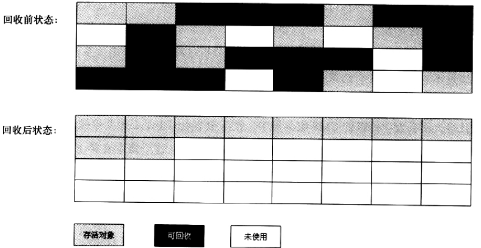

# 运行时的数据区域


## 方法区

方法区是储存已经被虚拟机加载类的具体信息：属性字段、常量、静态变量、结构体信息、方法数据、构造函数...，同时方法区是**线程共享**的

java虚拟机规定方法区是堆的逻辑部分，别名非堆（no-heap）

### 运行时常量池

储存编译期生成的字面量和符号引用，其储存在方法区中是**线程共享**的


## 堆

是虚拟机中内存占用最大的一块区域，主要存储运行时实例对象的数据，同时也是gc（垃圾回收）主要管理区域，所以也称为gc堆，是线程共享的

根据虚拟机规定，堆可以是在物理内存中不连续的，只要逻辑上连续即可

## 程序计数器（pc寄存器）

Program Counter Register

当前线程所执行的字节码的行号指示器，虚拟机根据计数器选取下一条需要执行的字节码指令（循环、跳转、分支、异常处理....）

当调用java方法时计数器中的值就是正在执行的字节码

当调用native原生方法时赋为空值

## 虚拟机栈

存储线程运行所需要的栈帧结构，并且将线程运行方法引用装配到栈帧中，然后依次入栈运行方法，包含线程运行所需要的类的引用，每一个线程都会分配一个虚拟机栈

### 栈帧

个人理解一个栈帧就是一个方法，方法的运行和结束对应栈帧的出栈和入栈，所以栈帧中需要包含方法运行的局部变量、动态链接、操作数栈等关键信息，每一个栈帧包含一个在运行时常量池中所属方法的引用

#### 局部变量

当前运行方法所需要的变量值引用

#### 动态链接

当前运行的方法中包含了其他方法的引用，就会产生动态链接

通俗讲，当方法1中调用方法2，那么在方法2执行结束之后继续运行方法1，虚拟机需要知道在运行方法2之前已经运行到方法1中的那个阶段，相当于一个标记

#### 操作数栈

将运行的操作按照顺序入栈，假设1+1-2，总要将+、- 存储下


# 对象

## 对象的创建

1.当我们使用new关键字等方式创建一个的类的时候，虚拟机首先会看看这个类是否已经被加载，

​	如果没有，实现类的加载过程

2.如果有被加载则根据加载时确定的对象大小在内存中分配指定的大小，

​	其中如果java堆中的内存是规整的（空闲的一块、占用的一块）那么只需要将占用的指针向空闲的内存中方向进行移动即可。

​	如果不是规整的，那么jvm需要一个记录表，记录哪些空间是空闲的，哪些是被占用的。

这一过程其实就是将对象的名字指向一个内存地址值

同时为了防止对象的指针被频繁操作，jvm还采用了类似于CAS事务保证操作的原子性

3.分配完内存空间之后，要给对象中的字段、属性值赋予初始值

## 对象的存储布局

### 对象头

第一部分：

​	对象自身运行时的数据：哈希值、GC分代年龄、状态锁、线程持有的锁、偏向线程id、偏向时间戳。这部分数据存储在 Mark Word

第二部分：

​	类型指针，也就是说虚拟机要知道这个对象是哪个类的实例

### 实例数据

所有定义的字段数据，包括了从父类继承的字段

### 对齐填充

Hotspot虚拟机要求对象存储地址必须是8个字节整数倍大小，而对象头都是8字节的1倍或者两倍，所以如果实例数据不是8字节的整数倍，需要对齐填充当做占位符

## 对象的访问

对象类型数据就是被虚拟机加载的类信息（即Class信息，见2.2.5方法区）

对象实例数据是对象new出来的实例信息

句柄访问、


指针访问


# GC（垃圾回收）

## 判断对象已死

gc要回收某一对象首先要判断该对象是否已经真的死亡，也就是说没有任何引用

### 引用计数算法

当该对象被引用+1，当对象被解除引用-1，当引用为0则视为死亡

在部分情况下该算法简单强大，但是很难解决对象之间循环引用问题，

```java
user1.friend = user2;
user2.friend = user1;
user1 = null;
user2 = null;

System.gc();
//上述代码按照 引用计数算法 定义应该不被回收，但是实际上还是被回收了，证明java中应该还有一个算法判断对象是否应该被回收
```

### 可达性算法

将对象和对象之间的引用关系用树来表示


如图所示从顶层节点到指定对象找引用关系如果引用关系（引用链）存在视为对象存活，否则对象死亡，图示中的obj 4和obj 5就是已经死亡的对象

在java中可作为GC Root对象有以下几种

1.虚拟机栈中引用的对象

2.方法区中类静态属性引用的对象

3.方法区中常量引用的对象

4.本地方法栈中引用的对象

### 对象引用

上面两个算法的关键都在于如何确定对象的引用属于该回收的范围，在jdk1.2之后对象的引用分为了四类

1.强引用：普遍存在代码中，Object  obj = new Object（） 

2.软引用（java.lang.ref.SoftReference）：对象还有用但是非必须，也就是说当jvm第二次发现内存进行第一次回收之后还不够用才会回收

3.弱引用（java.lang.ref.WeakReference）:比软引用还弱，不需要判断当前内存是否足够直接回收

4.虚引用（java.lang.ref.PhantomReference）：存在意义就是在回收时候通知虚拟机

### 对象死亡标记

在经过算法分析发现某一对象的引用链不存在，但也不会立马就宣布对象死亡，要经过标记的过程

首先会给这个对象一个标记进行一次筛选：

​	jvm判断此对象是否有必要执行finalize()，如果该对象没有重写finalize方法，或者该方法已经被执行过则视为没有必要执行

​	否则jvm会将该对象存放在队列中，稍后会启动一个低优先级finalizer线程去挨个执行队列中的方法，注意jvm并不一定会等该方法执行完毕，因为可能该方法会造成阻塞等问题影响正常的运行，如果该对象在finalize方法中将引用又挂到了引用链上则不会回收，该对象自救成功，否则死的透透的，但是**注意finalize方法无论如何只会被执行一次**

## 垃圾回收算法

### 标记-清除

先对需要回收的空间进行标记，然后进行清除回收

优点：

​	后续算法的基础

缺点：

​	效率不高，标记和清除两个过程

​	回收后的空间都是大量不连续的空间，如果有新的大空间对象需要存放，则需要再次出发gc，使得空间够用


### 复制

将内存分为两个部分，这样每次回收时，将存活对象复制到另一部分的空间中，然后直接回收标记的需要回收对象即可

也是商业虚拟机的主要收回：

​	将内存空间分为一块较大的Eden和两块较小的surviv，每次使用时将对象存放在一块Eden和survivor中，回收时将存活对象复制到另一块的survivor中


### 标记-整理

标记-清除的改进版，标记之后将存活对象向一边整理，回收被标记的对象即可



### 分代

对内存进行分代：年轻代、老年代，对于不同的分代区的对象特点进行不同的回收策略，比如年轻代的对象回收频率高则使用复制算法，老年代的回收不频繁则使用标记-清理、标记-整理算法

## 内存分配

新建的对象一般都在新生代的Eden区中，如果对象很大则直接晋升到老年代，比如说数组，如果小对象但是在多次的回收中都没有被回收，次数到达上限时则将该对象也放在老年代中

## 日志查看

```shell

2019-02-04T12:03:45.797+0800: 7.241: [GC (System.gc() 虚拟机自动发起的gc线程回收垃圾) [PSYoungGen（垃圾收集器种类、分代区，此处是年轻代）: 6851K（年轻代回收之前的大小）->1215K(33280K)年轻代回收之后的大小] 6851K（整个堆回收之前的大小）->1215K(110080K)回收之后, 0.1432069 secs] [Times: user=0.09 sys=0.03, real=0.14 secs] 

2019-02-04T12:03:45.941+0800: 7.385: [Full GC (System.gc()手动调用gc) [PSYoungGen: 1215K->0K(33280K)] [ParOldGen: 0K->1162K(76800K)] 1215K->1162K(110080K), [Metaspace: 3268K->3268K(1056768K)], 0.0961549 secs] [Times: user=0.03 sys=0.00, real=0.10 secs] 
Heap
 PSYoungGen      total 33280K, used 287K [0x00000000db100000, 0x00000000dd600000, 0x0000000100000000)
  eden space 28672K, 1% used [0x00000000db100000,0x00000000db147c58,0x00000000dcd00000)
  from space 4608K, 0% used [0x00000000dcd00000,0x00000000dcd00000,0x00000000dd180000)
  to   space 4608K, 0% used [0x00000000dd180000,0x00000000dd180000,0x00000000dd600000)
 ParOldGen       total 76800K, used 1162K [0x0000000091200000, 0x0000000095d00000, 0x00000000db100000)
  object space 76800K, 1% used [0x0000000091200000,0x00000000913229a0,0x0000000095d00000)
 Metaspace       used 3274K, capacity 4568K, committed 4864K, reserved 1056768K
  class space    used 347K, capacity 392K, committed 512K, reserved 1048576K
```

| 垃圾收集器种类           | 日志显示的种类    | 分代区  |
| ----------------- | ---------- | ---- |
| serial            | defNew     | 新生代  |
| parnew            | parNew     | 新生代  |
| parallel scavenge | PSYoungGen | 新生代  |


## 垃圾收集器

### serial 收集器

历史悠久、**最早的新生代垃圾收集器**，采用的是**单线程的模式**，

复制算法

缺点：

​	在收集器运行时，会停止其他的应用运行，造成间隔停顿

优点：

​	在所有 单线程的垃圾收集器中开销小、简单高效

适用场景：

​	client客户端模式下默认的新生代垃圾收集器

### parnew 收集器

**新生代**垃圾收集器，采用的是**多线程**的模式，**复制**算法

适用场景：

​	server模式下默认的新生代垃圾收集器

### parallel scavenge 收集器

**新生代**垃圾收集器，采用的是**多线程**的模式，**复制**算法，和parnew差不多，但是侧重点不同，其他的收集器侧重于停顿时间，其更侧重的是吞吐量

吞吐量=用户代码运行时间/(用户代码运行时间+垃圾收集时间)

### serial old 收集器

顾名思义，serial old是serial的**老年代**版本，同样也是**单线程**的模式，采用的是**标记-清理**的垃圾收集算法

### parallel old 垃圾收集器

是parallel scavenge的老年代版本，同时也是注重吞吐量的垃圾收集器，

标记-清理算法，在jdk1.6之后才出现

### cms 垃圾收集器

获取最短停顿时间为目标，标记-清除算法，多线程运行

分为四个阶段：

​	初始标记：标记所有 gc root能够关联的对象，阻断所有用户线程

​	并发标记：gc root tracing，和用户线程一起运行

​	重新标记：修正并发标记时因为用户线程的运行导致标记内容发生变化的记录部分，阻断所有用户线程

​	标记清除：和用户线程一起运行

优势：

​	并发收集、低停顿

缺点：

​	对cpu资源较为敏感，在非并发阶段（初始标记、重新标记）还是会阻断所有线程

​	无法处理浮动垃圾（因为清除时是和用户线程并发运行，所以在清除时出现的新的垃圾只能留到下一次gc）另外，也因为和用户线程同时运行，所以需要预留一部分内存空间给用户线程使用

​	基于标记-清除算法，这样会在垃圾收集后会有大量不规则的内存空间，往往出现老生代还有很大的剩余空间但是找不到连续的空间来储存对象，会再次触发gc，当然可以设置开关参数和执行次数来修补

### G1 垃圾收集器

最新的、服务端、可在未来替换cms的垃圾收集器，可以不需要和其他的垃圾收集器配合，

和之前的垃圾收集器不同的是，g1没有明显的分代的概念，只是将java堆分成了一个个的布局区域（region），

相比于cms的优势：

​	1.并发运行，充分利用硬件多cpu的优势，减少stop world 的停顿时间

​	2.不会产生大量的不连续的碎片空间，虽然整体上看是标记-清除算法，但是从局部来看是复制算法

​	3.分代的概念依旧存在，但是没有物理隔离，同样都是一个一个的局部的集合

​	4.预测停顿时间

