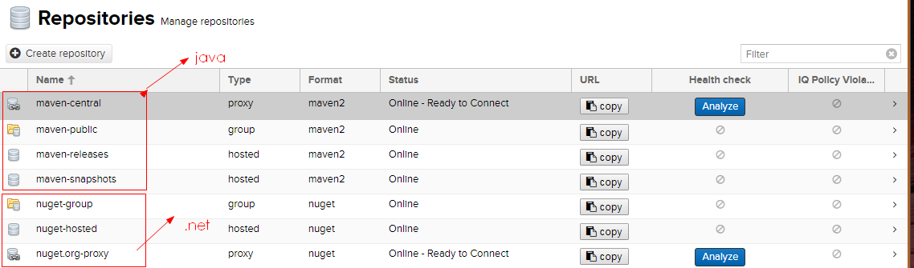
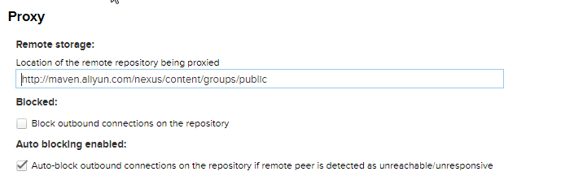

个人理解：

​	nexus就是远程的个人私有maven仓库，可以从下载、上传jar包

# 部署

## 1.下载安装

​	[从官网上下载nexus的包](https://www.sonatype.com/download-oss-sonatype)，上传到linux环境中，解压

​	1.1 解压之后是两个文件夹

​		nexus-{veriosn}

​		sonatype-work

## 2.启动nexus

​	nexus-{veriosn} /bin/nexus start

​	打开游览器输入{ip}:{port}/ 	即可访问（不能访问的话注意防火墙问题）

​	port 可在	nexus-{veriosn}/etc/nexus-default.properties 修改

## 3.相关配置

3.1 增加用户名密码：

​	 打开之后点击右上角的sign in 按钮，默认的用户名密码（admin admin123）

​	直接新增用户即可

### 3.2 [原始仓库说明](https://help.sonatype.com/repomanager3/configuration/repository-management)

​	

maven-* 都是java相关的 

nuget-*	都是.net相关的


#### maven-central

​	中央存储库，是个代理仓库（proxy）也就是说所有的依赖都会从这里去找，这里找不到的话才会从其设置的远程中央仓库去找，这里我设置为[阿里云的maven仓库](http://maven.aliyun.com/nexus/content/groups/public)（http://maven.aliyun.com/nexus/content/groups/public）



这个仓库只能下载不能直接上传

#### maven-releases、maven-snapshots

​	都属于宿主仓库（hosted），也就是上传自定义jar包的地址，（在pom文件中设置）

​	注意，如果使用的话要将 Deployment Polly属性设置为allowed redeploy

#### maven-public

​	属于集成仓库（group），内部是以上三个仓库的集成，对外暴露方便下载依赖，设置在setting文件中

## 4. 下载依赖

.修改setting.xml文件 ，重要节点信息如下

```xml
.......
<servers>
	<server>
      <id>nexus</id><!-- 和pom 文件中的设置配合使用 -->
      <username>nexus</username><!-- 用户名、密码 -->
      <password>nexus</password>
    </server>

    <server>
      <id>nexus release</id>
      <username>nexus</username>
      <password>nexus</password>
    </server>

    <server>
      <id>nexus snapshot</id>
      <username>nexus</username>
      <password>nexus</password>
    </server>
  </servers>

<mirrors>
	  <mirror>
        <id>nexus</id>
        <mirrorOf>*</mirrorOf>
        <name>Nexus myself</name>
        <url>http://118.25.194.36:8081/repository/maven-public/</url>
    </mirror> 
  </mirrors>
<profiles>
    <profile>    
      <id>jdk-1.8</id>    
      <activation>    
          <activeByDefault>true</activeByDefault>    
            <jdk>1.8</jdk>    
        </activation>    
      <properties>    
        <maven.compiler.source>1.8</maven.compiler.source>    
        <maven.compiler.target>1.8</maven.compiler.target>    
        <maven.compiler.compilerVersion>1.8</maven.compiler.compilerVersion>    
      </properties>    
  </profile>  
  
    <profile>
      <!-- 依赖仓库 -->
      <id>nexus</id>
        <repositories>
          <repository>
            <id>central</id>
            <url>http://118.25.194.36:8081/repository/maven-central/</url>
            <releases><enabled>true</enabled></releases>
            <snapshots><enabled>true</enabled></snapshots>
          </repository>
        </repositories>
      
		<!-- 插件仓库 -->
      <pluginRepositories>
          <pluginRepository>
            <id>central</id>
            <url>http://118.25.194.36:8081/repository/maven-central/</url>
            <releases><enabled>true</enabled></releases>
            <snapshots><enabled>true</enabled></snapshots>
          </pluginRepository>
        </pluginRepositories>
    </profile>
    
  </profiles>
    
  <activeProfiles>
    <activeProfile>nexus</activeProfile>
  </activeProfiles>
....
```

依赖下载流程：

修改完配置文件之后，使用此配置文件的项目下载依赖的时候首先会在私服的仓库 中下载，如果没有再从central配置的远程中央仓库中下载


## 5. 上传模块jar包

修改项目中的pom文件

```xml
<!-- artifactId节点修改如下，去掉SNAPSHOT -->
<artifactId>ownerSpring</artifactId>
....
<distributionManagement>
        <repository>
            <id>nexus release</id> <!-- 注意这个地方的id一定和setting中<server>id相同 -->
            <name>nexus releases</name>
            <url>http://118.25.194.36:8081/repository/maven-releases/</url>
        </repository>

        <snapshotRepository>
            <id>nexus snapshot</id>
            <name>nexus snapshots</name>
            <url>http://118.25.194.36:8081/repository/maven-snapshots/</url>
        </snapshotRepository>

    </distributionManagement>
....
<!-- 出现打包过程中的bug： 原生jdk中的某一个类找不到时，加入以下节点 -->
<build>
        <finalName>ownerSpring</finalName>
        <plugins>
            <plugin>
                <groupId>org.apache.maven.plugins</groupId>
                <artifactId>maven-compiler-plugin</artifactId>
                <version>3.1</version>
                <configuration>
                    <source>1.8</source>
                    <target>1.8</target>
                    <encoding>UTF-8</encoding>
                    <compilerArguments>
                        <verbose />
                        <bootclasspath>${java.home}/lib/rt.jar</bootclasspath>
                    </compilerArguments>
                </configuration>
            </plugin>

        </plugins>
    </build>

```

### 将nexus 加入系统名服务
方式一：systemed 方式

1. 修改 {nexus}/bin/nexus 文件
 将  INSTALL4J_JAVA_HOME_OVERRIDE 取消注释，并且将其设置为真实的jdk目录

2. 在 /etc/systemd/system 下新建一个文件 nexus.service
```shell
  [Unit]
    Description=nexus service
    After=network.target                                #在哪项服务启动后启动

  [Service]
    Type=forking
    ExecStart=/opt/nexus/nexus-3.13.0-01/bin/nexus start #nexus的安装目录
    ExecStop=/opt/nexus/nexus-3.13.0-01/bin/nexus stop
    User=root
    Restart=on-abort

  [Install]
    WantedBy=multi-user.target
```
3. 执行下列脚本
```shell
  systemctl deamon-reload
  systemctl enable nexus.service  
  systemctl start nexus.service
```