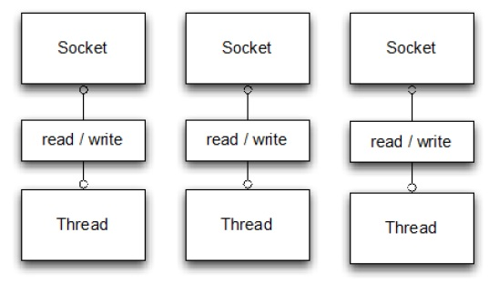
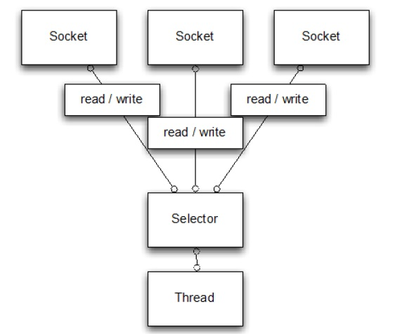
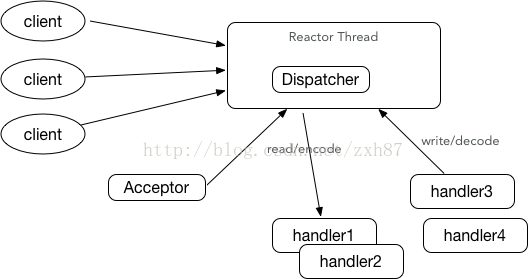
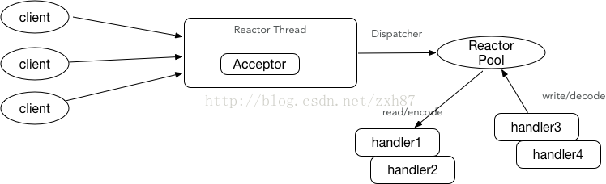
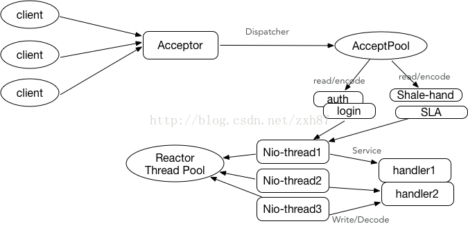

# Netty

个人理解：基于NIO的java网络编程框架，可以异步处理socket请求、长连接等


## NIO 和BIO区别

BIO



NIO



BIO 是在接收客户端的请求数据时默认是多线程模式，也就是说一个请求一个线程，这样高并发的时候容易造成服务器压力，

NIO 则是采用单线程模式，当一个Socket建立好之后，Thread并不会阻塞去接受这个Socket，而是将这个请求交给Selector，Selector会不断的去遍历所有的Socket，一旦有一个Socket建立完成，他会通知Thread，然后Thread处理完数据再返回给客户端——*这个过程是阻塞的*，这样就能让一个Thread处理更多的请求了。

传输快：

​	原因一：非阻塞读取数据

​	传统硬件的堵塞如下，从内存中读取数据，然后写到磁盘，而CPU一直等到磁盘写完成，磁盘的写操作是慢的，这段时间CPU被堵塞不能发挥效率。

​	NIO模式下，CPU只是发出写操作的指令，具体由DMA(Direct Memory Access   直接存储器存取)执行，DMA处理完数据之后会将中断事件传给CPU告诉它操作结束，这段时间内CPU处于空闲状态，可以进行其他操作

​	原因二：

​	NIO 传输快的另一个原因是--零拷贝，传统的拷贝流程都会讲数据先存在缓存区中，然后从缓存区中读取数据，或者读数据。零拷贝是直接将数据存在临时的内存块中，然后通过ByteBuf直接去读取数据

## 核心组件

### Channel:

管道或者通道，对应一个socket连接，类似于JDK中提供的nio包下channel，在netty中有独有的channel类---io.netty.channel.Channel是Netty框架自己定义的一个通道接口，Netty实现的客户端NIO套接字通道是NioSocketChannel，提供的服务器端NIO套接字通道是NioServerSocketChannel。

目前，可以把 Channel 看作是传入（入站）或者传出（出站）数据的载体。因此，它可以被打开或者被关闭，连接或者断开连接。

### ChannelHandler

##### 4.0 及以上

处理channel中的业务逻辑，个人理解有点类似于tomcat中处理请求 的前置、后置处理、启动、销毁这些方法的封装接口

```java
void handlerAdded(ChannelHandlerContext var1) throws Exception;

void handlerRemoved(ChannelHandlerContext var1) throws Exception;
```

分类：

- [`ChannelInboundHandler`](https://netty.io/4.1/api/io/netty/channel/ChannelInboundHandler.html) to handle inbound I/O events,（处理从客户端来的请求），并在ChannelPipeline中按照从上至下的顺序查找调用相应的ChannelInboundHandler。
- [`ChannelOutboundHandler`](https://netty.io/4.1/api/io/netty/channel/ChannelOutboundHandler.html) to handle outbound I/O operations.（处理返回客户端的请求）并在ChannelPipeline中按照从下至上的顺序查找调用相应的ChannelOutboundHandler。


##### 3.0

分类：

- [`ChannelUpstreamHandler`](https://netty.io/3.10/api/org/jboss/netty/channel/ChannelUpstreamHandler.html) handles  an upstream [`ChannelEvent`](https://netty.io/3.10/api/org/jboss/netty/channel/ChannelEvent.html).（对应ChannelInboundHandler）
- [`ChannelDownstreamHandler`](https://netty.io/3.10/api/org/jboss/netty/channel/ChannelDownstreamHandler.html) handles  a downstream [`ChannelEvent`](https://netty.io/3.10/api/org/jboss/netty/channel/ChannelEvent.html).（对应 ChannelOutboundHandler）

### ChannelPipeline

因为一个channel可能有多个ChannelHandler，所以需要一个存储的环境，ChannelPipeline作用就在于此

类似于Tomcat容器中的Filter链，属于设计模式中的责任链模式,其中还保存了ChannelHandlerContext

### ChannelHandlerContext

一个ChannelHandlerContext代表了一个ChannelHandler和ChannelPipeline之间的关系，ChannelHandlerContext创建于ChannelHandler被载入到ChannelPipeline的时候，ChannelHandlerContext主要功能是管理在同一ChannelPipeline中各个ChannelHandler的交互

### ByteBuf

字节缓冲区容器，代替Java中的ByteBuffer

### EventLoopGroup 

个人理解类似于java中的线程池，管理调度线程去处理请求，注册Channel，管理他们的生命周期

### Reactor线程模型

#### 单线程模型

异步非阻塞i/o，所有的i/o操作都不会导致阻塞。理论上一个线程可以独立处理所有的i/o相关的操作。和node.js类似




#### 多线程模型

和单线程相比多了一组线程组：

有一个nio线程负责处理客户端的连接；

增加了一组nio线程池来处理网络io操作



主要问题是一个线程处理客户端连接，可能存在安全和性能问题，例如并发百万客户端连接，或者服务端需要对客户端握手进行安全认证，但是认证本身非常损耗性能。

#### 主从模式

为了解决上述的两种模式的缺点，这种模式是相对来说合理的，也是官网推荐的



采用的是一个线程池去处理客户端连接，监听客户端的连接包括安全认证，但是等到链路创建完成就创建一个线程去处理具体的业务逻辑


## 核心流程：

[netty请求流程之boss请求流程](https://www.cnblogs.com/cishengchongyan/p/6160194.html)

