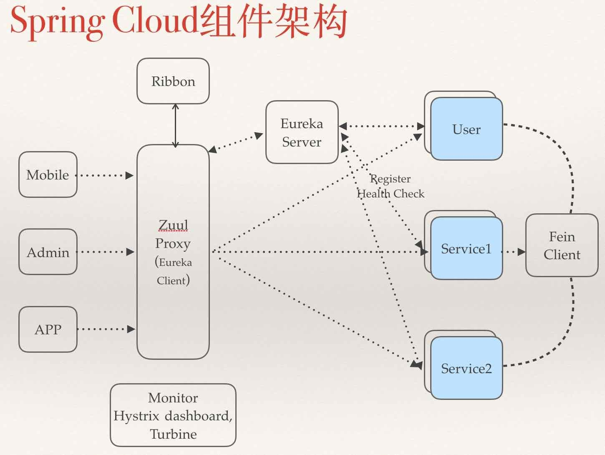
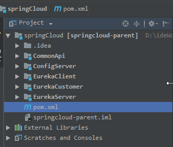
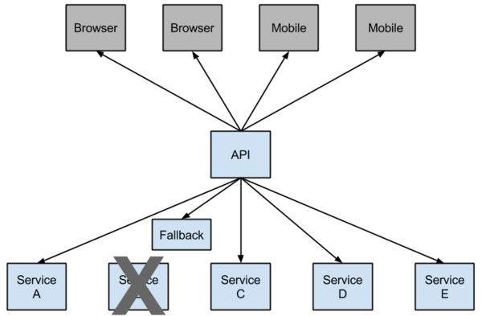
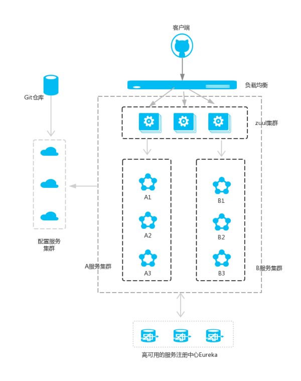
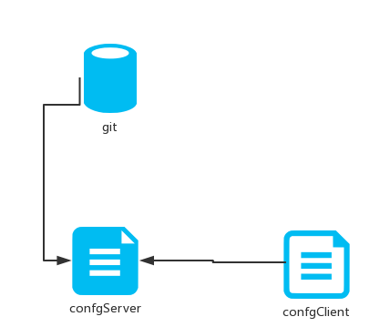
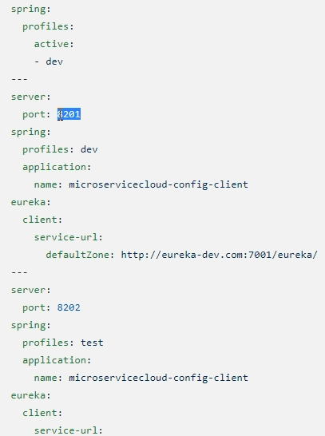

# 微服务

定义（特征）：

​	马丁富乐（创始人）：

​		微服务就是**将一个单一的应用分为多个小型微服务的架构**，

​		**每个服务运行在单独的进程中**，

​		**每个微服务只关注特定的业务功能**，

​		服务于服务之间**通过HTTP请求等轻量的通信机制实现服务间通信**，

​		这些服务可以**通过独立的部署机制进行全自动部署**，

​		共用一个小型的集中管理中心，

​		**可以用不同的编程语言、不同的数据库**

# Spring Cloud

## 定义

​	是基于Spring Boot的一整套实现微服务的框架。他提供了微服务开发所需的配置管理、服务发现、断路器、智能路由、微代理、控制总线、全局锁、决策竞选、分布式会话和集群状态管理等组件

## 组成



Netflix

**针对多种Netflix组件提供的开发工具包，其中包括Eureka、Hystrix、Zuul、Archaius等。**

[spring cloud Netflix Eureka](https://cloud.spring.io/spring-cloud-static/Finchley.SR2/single/spring-cloud.html#_spring_cloud_netflix)

**一个基于rest服务的服务治理组件，包括服务注册中心、服务注册与服务发现机制的实现，实现了云端负载均衡和中间层服务器的故障转移。**

### [Eureka Server（服务注册中心）](https://cloud.spring.io/spring-cloud-static/Finchley.SR2/single/spring-cloud.html#spring-cloud-eureka-server)

能干啥：

​	那么多微服务组件总要有一个服务调度中心，起到统一管理的作用，各个微服务想要发挥一定 的作用必须注册在服务中心

怎么玩：

- ​	创建一个父的空工程（只有pom文件和.idea文件夹）

  

  ```xml
  <?xml version="1.0" encoding="UTF-8"?>
  <project xmlns="http://maven.apache.org/POM/4.0.0" xmlns:xsi="http://www.w3.org/2001/XMLSchema-instance"
  		 xsi:schemaLocation="http://maven.apache.org/POM/4.0.0 http://maven.apache.org/xsd/maven-4.0.0.xsd">
  	<modelVersion>4.0.0</modelVersion>

  	<groupId>cn.hgf</groupId>
  	<artifactId>parent</artifactId>
  	<version>0.0.1-SNAPSHOT</version>
  	<packaging>pom</packaging>
  	..........
  	<parent>
  		<groupId>org.springframework.boot</groupId>
  		<artifactId>spring-boot-starter-parent</artifactId>
  		<version>2.0.4.RELEASE</version>
  	</parent>
  	........

    	<!-- 如果子pom文件使用其中的依赖不需要声明版本，起到版本同一作用 -->
  	<dependencyManagement>
  		<dependencies>

  			<dependency>
  				<groupId>org.springframework.cloud</groupId>
  				<artifactId>spring-cloud-dependencies</artifactId>
  				<version>${spring-cloud.version}</version>
  				<type>pom</type>
  				<scope>import</scope>
  			</dependency>
  			<!-- 第三方插件，简化get、set方法等 -->
  			<dependency>
  				<groupId>org.projectlombok</groupId>
  				<artifactId>lombok</artifactId>
  				<version>${lombok.version}</version>
  			</dependency>

  		</dependencies>
  	</dependencyManagement>

  	........

  	<modules>
  		<module>EurekaClient</module>
  		<module>EurekaServer</module>
  		<module>CommonApi</module>
  		<module>EurekaCustomer</module>
  		<module>ConfigServer</module>
  	</modules>
  </project>

  ```

  ​	

- 创建一个Spring Boot 的Module，使其继承上面的pom

  ```xml
  <modelVersion>4.0.0</modelVersion>

  	<artifactId>EurekaServer</artifactId>
  	<version>0.0.1-SNAPSHOT</version>
  	<packaging>jar</packaging>

  	<name>EurekaServer</name>
  	<description>spring cloud server</description>

  	<parent>
  		<groupId>cn.hgf</groupId>
  		<artifactId>parent</artifactId>
  		<version>0.0.1-SNAPSHOT</version>
  	</parent>

  	<properties>
  		<project.build.sourceEncoding>UTF-8</project.build.sourceEncoding>
  		<project.reporting.outputEncoding>UTF-8</project.reporting.outputEncoding>
  		<java.version>1.8</java.version>
  	</properties>

  	<dependencies>
        	<!-- 声明为服务注册中心依赖（maven官方推荐使用netflix的） -->
  		<dependency>
  			<groupId>org.springframework.cloud</groupId>
  			<artifactId>spring-cloud-starter-netflix-eureka-server</artifactId>
  		</dependency>
  	</dependencies>
  ```

  ​

- 配置文件相关配置

  ```properties
  server.port=8761
  eureka.instance.hostname=localhost

  #表明自身是一个注册中心不需要注册(必须设置为false，否则启动报错)
  eureka.client.register-with-eureka=false
  eureka.client.fetch-registry=false

  #注册中心的url，以供其他服务调用
  eureka.client.service-url.defaultZone=http://${eureka.instance.hostname}:${server.port}/eureka
  ```

- 配置类中加上@`EnableEurekaServer`

- 启动项目即可

  ​

自我保护机制：在一定时间周期内，如果微服务实例没有和注册中心发送心跳连接，会默认显示该服务实例下线，同时保留该服务实例的信息，在服务实例重新发送心跳之后，重新上线

##### **集群配置：**

创建同样的server项目

​	1.如果是windows环境修改host文件

```properties
127.0.0.1 server8001.com
127.0.0.1 server8000.com
127.0.0.1 server8002.com
```

       	2. 修改配置文件(以8001为例)

```pro
eureka.instance.hostname=server8001.com
ureka.client.service-url.defaultZone=http://server8002.com:8002/eureka,http://server8000.com:8000/eureka
```


### [Eureka Client（服务实例）](https://cloud.spring.io/spring-cloud-static/Finchley.SR2/single/spring-cloud.html#_service_discovery_eureka_clients)

能干啥：服务发现客户端,服务注册在服务中心,由注册中心统一管理

怎么玩：

1.加入依赖，（也是继承父文件）

```xml
<dependency>
  <groupId>org.springframework.cloud</groupId>
  <artifactId>spring-cloud-starter-netflix-eureka-client</artifactId>
</dependency>
```

2.配置文件修改(可以放在`bootStarp.yml` 配置文件中为了以后作为config 中心)

```yaml
server:
  port: 8084

eureka:
  instance:
    hostname: localhost
  client:
    service-url:
      #注册中心的域名（可以有多个）
      defaultZone: http://${eureka.instance.hostname}:8761/eureka

spring:
  application:
    #实例名（显示在注册中心，其他组件调用时可以根据此实例名进行调用）
    name: service-provide-a
```


3.配置类上加入注解@`EnableEurekaClient`

4.启动测试，访问注册中心的http://{host：port}，会出现注册中心页面，有多少实例都会显示

### [Ribbon（负载均衡）](https://cloud.spring.io/spring-cloud-static/Finchley.SR2/single/spring-cloud.html#spring-cloud-ribbon)

是什么：**客户端负载均衡**的服务调用组件

​		也就是微服务之间基于restful 调用的方式之一（还有一种是集成Jersey框架）

能干啥：

​		上面的Eureka Client 可以看做是服务的提供者，那么服务如果消费（调用），Ribbon就是服务消费方消费的方法之一（还有feign）


怎么玩：

​	1.创建新的微服务项目作为服务消费者，加入依赖

```xml
<dependency>
  	<groupId>org.springframework.cloud</groupId>
  	<artifactId>spring-cloud-starter-netflix-eureka-client</artifactId>
</dependency>
<dependency>
  	<groupId>org.springframework.cloud</groupId>
  	<artifactId>spring-cloud-starter-netflix-ribbon</artifactId>
</dependency>
```

​	2.配置文件和服务的提供者（上面的Eureka Client）大致一样，把实例名更改就行（spring. application.name)

​	3.加入注解以及相应的调用工具

```java
@SpringBootApplication
@EnableEurekaClient
@RestController
public class ServiceRibbonApplication {

    public static void main(String[] args) {
        SpringApplication.run( ServiceRibbonApplication.class, args );
    }

    @Bean
    @LoadBalanced
    RestTemplate restTemplate() {
        return new RestTemplate();
    } 
	@GetMapping("/test")
  	public String test(){
    	return restTemplate.getForObject( "http://SERVICE-PROVIDE-A/employee/getById?id=" + id,Employee.class);

  	}
}
```


##### 负载规则：

以下都是类，且直接或间接继承`AbstractLoadBalancerRule`抽象类，实现`IRule`接口

**` WeightedResponseTimeRule`** (extends `RoundRobinRule`)

​	按照响应时间分配权值，响应时间越长权值越小，选中可能性越低

**`AvailabilityFilteringRule`**  (extends `PredicateBasedRule`)

​	过滤掉那些因为一直连接失败的被标记为circuit tripped的后端server，并过滤掉那些高并发的的后端server（active connections 超过配置的阈值）

**`RoundRobinRule`**

​	轮询（默认；按顺序一个接下一个）

**` RandomRule`**

​	随机分配

**`BestAvailableRule`**(extends `ClientConfigEnabledRoundRobinRule`)

​	选择一个并发量最小的

**`RetryRule`**

​	对选定的负载均衡策略机上重试机制。

**`ZoneAvoidanceRule`**(extends `PredicateBasedRule`)

​	复合判断server所在区域的性能和server的可用性选择server


### 	[`openFeign`（负载均衡）](https://cloud.spring.io/spring-cloud-static/Finchley.SR2/single/spring-cloud.html#_spring_cloud_openfeign)

`是什么：`

​	`openFeign`是声明式的web客户端，基于注解+接口的形式,而在spring cloud中对openFeign做了集成，默认集成了ribbon，hystrix

能干啥：

​	作用和ribbon差不多，但是更加灵活方便

怎么玩：

​	1.在服务消费者加入依赖

```xml
<dependency>
    <groupId>org.springframework.cloud</groupId>
    <artifactId>spring-cloud-starter-openfeign</artifactId>
</dependency>
```

​	2.创建feign调用服务提供者的接口

```java
@FeignClient(value = "service-provide-a")
@Service
public interface EmployeeCustomerService {

    @GetMapping("/employee/test")
    String test();

    @GetMapping("/employee/getName")
    String getName();
}
```

​	3.控制层依赖注入此接口

​	4.开启feign的注解@EnableFeignClients


### [Hystrix（熔断器）](https://cloud.spring.io/spring-cloud-static/Finchley.SR2/single/spring-cloud.html#_circuit_breaker_hystrix_clients)

是什么：熔断器，处理分布式系统的延迟和容错的开源库

能干啥：

​		避免一个服务节点发生异常时，导致故障级联进而真个服务瘫痪的局面，所以hystrix就是保证及时服务出现问题也能返回一个预备的响应（fall back），提高整个服务的容灾能力



怎么玩：

​	1.在服务消费者加入依赖

```xml
<!-- maven官方推荐 -->
<dependency>
    <groupId>org.springframework.cloud</groupId>
    <artifactId>spring-cloud-starter-netflix-hystrix</artifactId>
</dependency>
```

​	有两种集成方式：ribbon、feign

​	ribbon

​		在控制层添加一个方法，然后在调用的方法上加上注解

```java
	@GetMapping("/test")
    @HystrixCommand(fallbackMethod = "hystrixMethod")
    public String test(){

        return employeeCustomerService.test();
    }

	public String hystrixMethod(){
        return "error";
	}
```

​		配置类上加上注解@EnableHystrix 

feign：

​	增加一个employeeCustomerService的实现类，实现其中方法

​	修改注解内容

```java
@FeignClient(value = "service-provide-a",fallback = SchedualServiceHiHystric.class)
```

​	也可以新建一个类实现`FallbackFactory`<T>接口

​	修改注解

```java
@FeignClient(value = "service-provide-a",fallbackFactory = FallbackFactoryImpl.class)
```


​	修改yml 文件

```yaml
feign:
  hystrix:
    enabled: true
```

这就是服务降级，在客户端层面暂停部分服务，已达到整体资源的正常使用

### [Zuul（路由网关）](https://cloud.spring.io/spring-cloud-static/Finchley.SR2/single/spring-cloud.html#_router_and_filter_zuul)

是什么：服务网关

能干啥：包含过滤和转发功能

​	转发：将外部的请求转发到具体的服务实例,

​	过滤：对请求进行预干扰判断，初步过滤提高安全

现在微服务的大致架构就是外部请求由负载均衡分配到Zuul集群再转发到服务实例群



**怎么玩：**

​	1.在config Server项目中添加依赖

```xml
<dependency>
  <groupId>org.-springframework.cloud</groupId>
  <artifactId>spring-cloud-starter-netflix-zuul</artifactId>
</dependency>

<!-- 配置中心同时也是eureka服务 -->
<dependency>
  <groupId>org.springframework.cloud</groupId>
  <artifactId>spring-cloud-starter-netflix-eureka-client</artifactId>
</dependency>
```

​	2.添加路径映射规则

```yaml
server:
  port: 9001

zuul:
  routes:
    service-provide-a:
      #只要访问路径带有{path}，那么都会转发到指定的{serviceId}实例
      path: /service-a/**
      serviceId: service-provide-a
    service-provide-b:
      path: /service-b/**
      serviceId: service-provide-b
  #映射前缀（可以不加）    
  prefix: /my
spring:
  application:
    name: getway-a

eureka:
  instance:
    hostname: localhost
  client:
    service-url:
      defaultZone: http://${eureka.instance.hostname}:8761/eureka

```

​	3.添加启动注解@`EnableZuulProxy` 和 @`EnableEurekaClient`

​	4.注意启动的时候必须先让配置文件中的服务在注册中心注册之后再启动，否则报错

### [`Config`（配置管理）](https://cloud.spring.io/spring-cloud-static/Finchley.SR2/single/spring-cloud.html#_spring_cloud_config)

**官网定义**：由git存储库支持的集中式外部配置管理。配置资源直接映射到Spring `Environment`

**能干啥**：

​		在分布式系统中，由于服务数量巨多，为了方便服务配置文件统一管理，实时更新，所以需要分布式配置中心组件。支持git和本地存储（内存）统一的配置文件

​		有两个角色：config server（配置服务中心）、config client（配置使用）

​		通俗讲就是config server服务组件将配置文件的信息从git（本地）拉取配置然后以供config client使用



**怎么玩**：

config Server 端：

​	准备：在git仓库下新建配置文件

​	{application Name}-{profile}.properties/yml

​	1.添加项目maven依赖

```xml
<dependency>
  	<groupId>org.springframework.cloud</groupId>
  	<artifactId>spring-cloud-config-server</artifactId>
</dependency>
```

​	2 修改项目配置文件

```yaml
server:
  port: 8002

spring:
  application:
    name: config-server
  cloud:
    config:
      discovery:
        enabled: true
      server:
        git:
          uri: https://gitee.com/hanscoding/springCloud.git
          #配文件在git上的目录
          search-paths: /**
          username: Hans.he
          password: **********
      #分支名    
      label: master

eureka:
  client:
    service-url:
      defaultZone: http://localhost:8761/eureka
  instance:
    instance-id: config-server
    prefer-ip-address: true

```

​	3.加上启动注解@`EnableConfigServer` 和 @`EnableEurekaClient`

config client端：

​	1.添加依赖

```xml
<!--配置中心客户端-->
<dependency>
  	<groupId>org.springframework.cloud</groupId>
  	<artifactId>spring-cloud-starter-config</artifactId>
</dependency>

<dependency>
  	<groupId>org.springframework.cloud</groupId>
  	<artifactId>spring-cloud-starter-netflix-eureka-client</artifactId>
</dependency>
```

​	2.添加一个配置文件`bootstrap.yml`(一会下面讲为啥)

```yaml
server:
  port: 8084

eureka:
  instance:
    hostname: localhost
    #显示ip地址
    prefer-ip-address: true
  client:
    service-url:
      #注册中心的域名（可以有多个）
      defaultZone: http://${eureka.instance.hostname}:8761/eureka
spring:
  application:
    #实例名（显示在注册中心,）
    #注意这里的名字一定要和github下文件名前缀一样否则报错
    name: service-provide-a
    
#config client 的配置是在 bootstrap 文件中
  cloud:
    config:
      discovery:
        #开启配置服务发现
        enabled: true
        #配置服务端的实例名
        service-id: CONFIG-SERVER
      #默认分支
      label: master
      #配置环境和git远程仓库下配置文件的命名有关
      profile: dev
      #注册中心的url
      uri: http://localhost:8002
```

​	3.使用时直接用注解@Value("${property Name}")

访问时：

/{application}/{profile}[/{label}]
/{application}-{profile}.yml
/{label}/{application}-{profile}.yml
/{application}-{profile}.properties 

/{label}/{application}-{profile}.properties

上面git下的配置文件也可以改为yml(下面是网上截图)



### [bus（消息总线）](https://cloud.spring.io/spring-cloud-static/Finchley.SR2/single/spring-cloud.html#_spring_cloud_bus)

是什么（官网翻译）

​	Spring Cloud Bus将分布式系统的节点与轻量级消息代理链接。

能干啥：

​	这可以用于广播状态更改（例如配置更改）或其他管理指令。一个关键的想法是，总线就像一个分布式执行器，用于扩展的Spring Boot应用程序，但也可以用作应用程序之间的通信通道。目前唯一的实现是使用AMQP代理作为传输，但是相同的基本功能集（还有一些取决于传输）在其他传输的路线图上。

​	个人理解：广播配置文件 的更改和服务监控

怎么玩：

实现配置文件更改后实时修改所有应用此配置文件的服务配置（简单说刷新配置）

​	前提运行 的系统上要有`rabbitmq`

​	1.直接在config client添加依赖

```xml
<dependency>
    <groupId>org.springframework.cloud</groupId>
    <artifactId>spring-cloud-starter-bus-amqp</artifactId>
</dependency>

<dependency>
    <groupId>org.springframework.boot</groupId>
    <artifactId>spring-boot-starter-actuator</artifactId>
</dependency>
```

​	2.修改配置文件

```yaml
spring:
  rabbitmq:
    host: 106.12.212.87
    username: guest
    password: guest
    port: 5672
management:
  endpoint:
    bus-refresh:
      enabled: true
  #开启访问端口
  endpoints:
    web:
      exposure:
        include: bus-refresh	
bus:
  enabled: true
  trace:
    enabled: true
     
```

​	3.加上注解@`RefreshScope`

​	此时如果远程git仓库的配置文件被修改，访问{ip}:{port}/bus/refresh 就能刷新配置

## bootstrap	

​	[spring cloud关于bootstrap解释原文：](https://cloud.spring.io/spring-cloud-static/Finchley.SR2/single/spring-cloud.html#_spring_cloud_context_application_context_services)

​	大致翻译如下：

​		spring cloud 提供了一个application context的父上下文也就是bootstrap context来操作，负责从外部加载资源，同时共享一个environment。

​		bootstrap优先级比较高，资源配置不会被覆盖，又因为两者的配置不相同所以使用两种配置文件（`bootstrap.yml/properties` 、`application.yml/properties`）

​	例如官方建议bootstrap如下配置

```yaml
spring:
  application:
    name: foo
  cloud:
    config:
      uri: ${SPRING_CONFIG_URI:http://localhost:8888}
```

可以通过设置`spring.cloud.bootstrap.enabled=false`（例如在系统属性中）来完全禁用引导过程。(没试过)