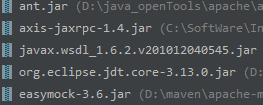
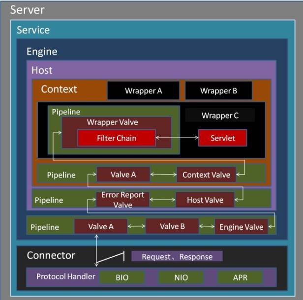

# 源码分析

准备工作：

[源码包下载地址](http://mirror.bit.edu.cn/apache/tomcat/tomcat-7/v7.0.91/src/apache-tomcat-7.0.91-src.zip)

相关jar导入、tomcat默认的构建工具ant下载安装



## 启动：

1.tomcat 启动是通过startup.bat/sh 来启动的，

```bash
........
done

PRGDIR=`dirname "$PRG"`
EXECUTABLE=catalina.sh
......
else
  if [ ! -x "$PRGDIR"/"$EXECUTABLE" ]; then
    echo "Cannot find $PRGDIR/$EXECUTABLE"
    echo "The file is absent or does not have execute permission"
    echo "This file is needed to run this program"
    exit 1
  fi
fi

exec "$PRGDIR"/"$EXECUTABLE" start "$@"
```

大致就是调用catalina.sh

```sh

........
  shift
  touch "$CATALINA_OUT"
  if [ "$1" = "-security" ] ; then
    if [ $have_tty -eq 1 ]; then
      echo "Using Security Manager"
    fi
    shift
    eval 
    .....
      -Djava.io.tmpdir="\"$CATALINA_TMPDIR\"" \
      org.apache.catalina.startup.Bootstrap "$@" start \
      >> "$CATALINA_OUT" 2>&1 "&"

  else
    eval
    	.......
      org.apache.catalina.startup.Bootstrap "$@" start \
      >> "$CATALINA_OUT" 2>&1 "&"

  fi

 #看不懂其他的操作，都是设置环境变量等等（启动类看到了org.apache.catalina.startup.Bootstrap）

```

2. BootStrap 的main方法大致

```java
//关键部分
           
Bootstrap bootstrap = new Bootstrap();
bootstrap.init();//见2.1
daemon = bootstrap;
//启动调用
daemon.load(args);//2.2
daemon.start();//2.3
        
```

​	2.1 BootStrap的 `init` 方法如下

```java
//简单说就是准备环境、反射调用Catalina类的setParentClassLoader方法
public void init()
        throws Exception
    {
        setCatalinaHome();
        setCatalinaBase();
       。。。。。。。。。
        Class<?> startupClass =
            catalinaLoader.loadClass
            ("org.apache.catalina.startup.Catalina");
        Object startupInstance = startupClass.newInstance();
		。。。。。。。
        String methodName = "setParentClassLoader";
        。。。。。。。。
        Method method =
            startupInstance.getClass().getMethod(methodName, paramTypes);
        method.invoke(startupInstance, paramValues);

        catalinaDaemon = startupInstance;

    }
```

​	2.2 

```java
private void load(String[] arguments)
        throws Exception {
  		//简单说调用Catalina的load（）
        String methodName = "load";
       	......
        Method method =
            catalinaDaemon.getClass().getMethod(methodName, paramTypes);
        ........
        method.invoke(catalinaDaemon, param);

    }
```

​	2.3

```java
public void start()
        throws Exception {
		....
        Method method = catalinaDaemon.getClass().getMethod("start", (Class [] )null);
        method.invoke(catalinaDaemon, (Object [])null);

    }
```

3. Catalina.load()

```java
public void load() {

  Digester digester = createStartDigester();
  file = configFile();
  inputStream = new FileInputStream(file);
  inputSource = new InputSource(file.toURI().toURL().toString());
  inputSource.setByteStream(inputStream);
  digester.push(this);
  digester.parse(inputSource);
  //上面部分就是 创建一个xml解析器Digester（基于sax解析的工具），然后安装配置xml文件的配置进行解析，将启动组件装配到tomcat容器中，

  getServer().setCatalina(this);
  //这里的server 是 StandardServer 类
  getServer().init();
        
 }
```

​	3.1 `createStartDigester()`

```java
protected Digester createStartDigester() {
        long t1=System.currentTimeMillis();
        // Initialize the digester
        Digester digester = new Digester();
  		//是否开启dtd 协议解析
        digester.setValidating(false);
  		 // 是否进行节点设置规则校验,如果xml中相应节点没有设置解析规则会在控制台显示提示信息
        digester.setRulesValidation(true);
        HashMap<Class<?>, List<String>> fakeAttributes =
            new HashMap<Class<?>, List<String>>();
        ArrayList<String> attrs = new ArrayList<String>();
  // 将xml节点中的className作为假属性，不必调用默认的setter方法（一般的节点属性在解析时将会以属性值作为入参调用该节点相应对象的setter方法，而className属性的作用是提示解析器用该属性的值来实例化对象）
        attrs.add("className");
        fakeAttributes.put(Object.class, attrs);
        digester.setFakeAttributes(fakeAttributes);
        digester.setUseContextClassLoader(true);

        
        //addObjectCreate 是指根据{server}节点和className创建一个 对象
        digester.addObjectCreate("Server",
                                 "org.apache.catalina.core.StandardServer",
                                 "className");
  		//addSetProperties 调用该节点对应类的以set+属性名形式的方法
  		//比如<Server port="8005" shutdown="SHUTDOWN">
  		//则调用{server}对应类的 setPort 和 setShutdown方法
        digester.addSetProperties("Server");
  		//addSetNext 当解析到{server}节点时，调用指定方法
        digester.addSetNext("Server",
                            "setServer",
                            "org.apache.catalina.Server");

        digester.addObjectCreate("Server/GlobalNamingResources",
                                 "org.apache.catalina.deploy.NamingResources");
        digester.addSetProperties("Server/GlobalNamingResources");
        digester.addSetNext("Server/GlobalNamingResources",
                            "setGlobalNamingResources",
                            "org.apache.catalina.deploy.NamingResources");

        digester.addObjectCreate("Server/Listener",
                                 null, // MUST be specified in the element
                                 "className");
        digester.addSetProperties("Server/Listener");
        digester.addSetNext("Server/Listener",
                            "addLifecycleListener",
                            "org.apache.catalina.LifecycleListener");

        digester.addObjectCreate("Server/Service",
                                 "org.apache.catalina.core.StandardService",
                                 "className");
        digester.addSetProperties("Server/Service");
        digester.addSetNext("Server/Service",
                            "addService",
                            "org.apache.catalina.Service");

        digester.addObjectCreate("Server/Service/Listener",
                                 null, // MUST be specified in the element
                                 "className");
        digester.addSetProperties("Server/Service/Listener");
        digester.addSetNext("Server/Service/Listener",
                            "addLifecycleListener",
                            "org.apache.catalina.LifecycleListener");

        //Executor
        digester.addObjectCreate("Server/Service/Executor",
                         "org.apache.catalina.core.StandardThreadExecutor",
                         "className");
        digester.addSetProperties("Server/Service/Executor");

        digester.addSetNext("Server/Service/Executor",
                            "addExecutor",
                            "org.apache.catalina.Executor");


        digester.addRule("Server/Service/Connector",
                         new ConnectorCreateRule());
        digester.addRule("Server/Service/Connector",
                         new SetAllPropertiesRule(new String[]{"executor"}));
        digester.addSetNext("Server/Service/Connector",
                            "addConnector",
                            "org.apache.catalina.connector.Connector");


        digester.addObjectCreate("Server/Service/Connector/Listener",
                                 null, // MUST be specified in the element
                                 "className");
        digester.addSetProperties("Server/Service/Connector/Listener");
        digester.addSetNext("Server/Service/Connector/Listener",
                            "addLifecycleListener",
                            "org.apache.catalina.LifecycleListener");

        // Add RuleSets for nested elements
        digester.addRuleSet(new NamingRuleSet("Server/GlobalNamingResources/"));
        digester.addRuleSet(new EngineRuleSet("Server/Service/"));
        digester.addRuleSet(new HostRuleSet("Server/Service/Engine/"));
        digester.addRuleSet(new ContextRuleSet("Server/Service/Engine/Host/"));
        addClusterRuleSet(digester, "Server/Service/Engine/Host/Cluster/");
        digester.addRuleSet(new NamingRuleSet("Server/Service/Engine/Host/Context/"));

        // When the 'engine' is found, set the parentClassLoader.
        digester.addRule("Server/Service/Engine",
                         new SetParentClassLoaderRule(parentClassLoader));
        addClusterRuleSet(digester, "Server/Service/Engine/Cluster/");

        return (digester);
  		//如此看出上述这些组件是一个包含了下一组件的引用，
  

    }
```

​	3.2 

```java
//StandardServer.init() 方法继承自LifecycleBase，由LifecycleBase实现
//最主要的是这里的 initInternal 方法
public final synchronized void init() throws LifecycleException {
	.......
    setStateInternal(LifecycleState.INITIALIZING, null, false);
    
    initInternal();
    setStateInternal(LifecycleState.INITIALIZED, null, false);
    ....... 
    }
```


4. Catalina.start()

```java
public void start() {
....
  //StandardServer.start() 方法
 getServer().start();

  ......

    if (await) {
      await();
      stop();
    }
    }
```

​	4.1 

```java
//和上文的init类似，继承自 LifecycleBase，由LifecycleBase实现
//最主要的是这里的 startInternal（） 方法
public final synchronized void start() throws LifecycleException {
  ......
    setStateInternal(LifecycleState.STARTING_PREP, null, false);
  startInternal();
  ......

}
```

5. `StandardServer.initInternal`()

```java
protected void initInternal() throws LifecycleException {
        //调用父类LifecycleMBeanBase的initInternal（）
        super.initInternal();

        .........
        // Initialize our defined Services
        for (int i = 0; i < services.length; i++) {
          	//这里的service也就是之前解析xml文件中的那些组件，默认都是实现Lifecycle接口
          //StandardService
            services[i].init();
        }
    }
```

6. `StandardServer.startInternal`

```java
protected void startInternal() throws LifecycleException {

        fireLifecycleEvent(CONFIGURE_START_EVENT, null);
        setState(LifecycleState.STARTING);

        globalNamingResources.start();
        
        // Start our defined Services
        synchronized (servicesLock) {
            for (int i = 0; i < services.length; i++) {
              //这里的service也就是之前解析xml文件中的那些组件，默认都是实现Lifecycle接口
              //StandardService
                services[i].start();
            }
        }
    }
```

**小结：tomcat中实现了Lifecycle的接口，其init方法都是先调用LifecycleBase的init方法，然后调用自身类中的initInternal();start() 也是先调用LifecycleBase的start方法，然后调用自身类中的startInternal()；**

7. `StandardService.initInternal`()

   ```java
   //由此看出这里启动了其他组件的init方法
   protected void initInternal() throws LifecycleException {

           super.initInternal();
           
           if (container != null) {
               container.init();
           }

           // Initialize any Executors
           for (Executor executor : findExecutors()) {
               ...
               executor.init();
           }

           // Initialize our defined Connectors
           synchronized (connectorsLock) {
               for (Connector connector : connectors) {
                   ...
                   connector.init();
                   ....
               }
           }
       }
   //上述的几个组件初始化时会启动其他的组件的初始化方法，也就是一个组件调用下一个组件
   ```

   8. `StandardService.startInternal`

   ```java
   //和上文相对应的是启动
   protected void startInternal() throws LifecycleException {

           ...
             //这里的container 是StandardEngine
           if (container != null) {
               synchronized (container) {
                   container.start();
               }
           }
   		
           synchronized (executors) {
               for (Executor executor: executors) {
                   executor.start();
               }
           }
   		//
           synchronized (connectorsLock) {
               for (Connector connector: connectors) {
                    ...... 
                   connector.start();
                  .....
               }
           }
       }
   //上述组件启动调用其他组件的startInternal（） 方法
   ```

   ​




## Lifecycle

tomcat 组件的生命周期是初始化（init）、启动（start）、停止（stop）、消亡（destroy）

```java
//主要方法
	public static final String BEFORE_INIT_EVENT = "before_init";
	
    public static final String AFTER_INIT_EVENT = "after_init";

    public static final String START_EVENT = "start";

    public static final String BEFORE_START_EVENT = "before_start";

    public static final String AFTER_START_EVENT = "after_start";

    public static final String STOP_EVENT = "stop";

    public static final String BEFORE_STOP_EVENT = "before_stop";

    public static final String AFTER_STOP_EVENT = "after_stop";

    public static final String AFTER_DESTROY_EVENT = "after_destroy";

    public static final String BEFORE_DESTROY_EVENT = "before_destroy";

    public static final String PERIODIC_EVENT = "periodic";

    public static final String CONFIGURE_START_EVENT = "configure_start";

    public static final String CONFIGURE_STOP_EVENT = "configure_stop";
	//加入事件监听
    public void addLifecycleListener(LifecycleListener listener);
	
    public LifecycleListener[] findLifecycleListeners();

    public void removeLifecycleListener(LifecycleListener listener);

    public void init() throws LifecycleException;

    public void start() throws LifecycleException;

    public void stop() throws LifecycleException;
  
    public void destroy() throws LifecycleException;

```

## Container

tomcat 组件除去最外层的server、service，核心是四层结构 Engine、Host、Context、Wrapper，而这四个都是接口继承了Container，而同时Container又继承了上文的Lifecycle，


## 关闭

java中有守护线程、用户线程区别，当用户线程全部杀死，守护线程也是自动结束运行，从而退出程序运行

```java
//StandradService
protected void stopInternal() throws LifecycleException {

        // Pause connectors first
        synchronized (connectorsLock) {
            for (Connector connector: connectors) {
                    connector.pause();
            }
        }

        
        if (container != null) {
            synchronized (container) {
                container.stop();
            }
        }

        synchronized (connectorsLock) {
            for (Connector connector: connectors) {
               
                  connector.stop();
                
            }
        }

        .......
    }
```


