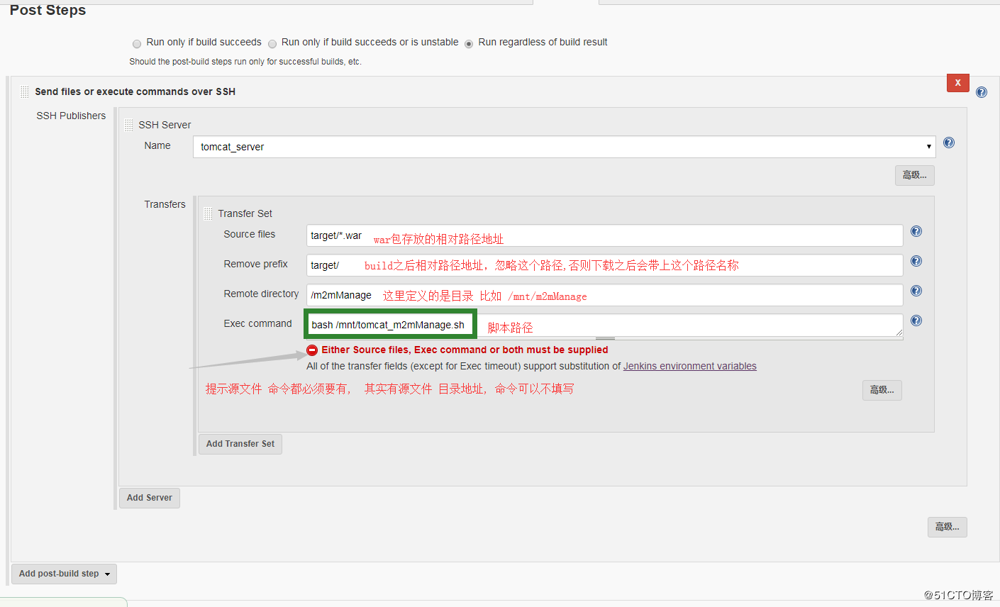

# Jenkins

## 安装

### 1.docker方式

```shell
1.先从仓库中pull镜像
	docker pull jenkins
2.创建需要挂载的目录
	mkdir /opt/jenkins
3.设置目录的uid为1000，否则发生权限问题（https://yq.aliyun.com/articles/53990）
	chown -R 1000 jenkins
4.运行Jenkins
	docker run -p [8083]:8080 -p 50000:50000 -v /opt/jenkins:/var/jenkins_home jenkins
此事可能发生错误：
 		Error response from daemon: driver failed programming external connectivity on endpointlaughing_hypatia(6308ab72beb711eb0f7d6eaa5e0303ba2e82c8320cafd21417d8bb20a475de1d):  (iptables failed: iptables --wait -t filter -A DOCKER ! -i docker0 -o docker0 -p tcp -d 172.18.0.2 --dport 50000 -j ACCEPT: iptables: No chain/target/match by that name.

		解决方案：重启docker
```

## 部署

通过以上安装方式运行后访问jenkins首页，

docker方式直接就是ip:port，

从/var/jenkins_home/secrets/initialAdminPassword文件中拿到秘钥输入在首页中

### token

`074cd2e073af9227b6b3694c5b03570aace27606` 

### maven 配置参数

```shell
/opt/apache-maven-3.5.4/bin/mvn clean package -Dmaven.test.skip=true
#-Dmaven.test.skip=true  表示跳过测试方法的运行测试和编译
```

## 通过war包方式
	将官网上的war包下载到本地，放在tomcat的webapp下即可
	注意：可能jenkins会启动失败，查看日志也许是内存不足，因为tomcat的分配缓存不够
	修改${tomcat}/conf/context.xml 文件
	在<context> 节点中加入
	    <Resources cachingAllowed="true" cacheMaxSize="100000" />

## jenkins +spring boot +maven +github实现自动部署并且通过域名访问

在选择jenkins构建后的步骤时，只选择maven构建即可

思路：

​	先用jenkins自动化部署将所需要的项目代码从github上拷贝下，然后用linux命令的形式将部署好的war包发送到指定的tomcat目录（现在是一个服务器）下，然后启动tomcat即可

```shell
#最后运行的tomcat的目录
TOMECAT_HOME="/opt/tomcat-8_8081"
#tomcat运行端口
TOMECAT_PORT=8081
#jenkins打包成war包之后存放的目录
JENKINS_TARGET_HOME="/root/.jenkins/workspace/SpringBootDemo_free/target"
#jenkins打包成war包的名字
JENKINS_WAR_NAME="SpringBoot-1.0-SNAPSHOT.war"
#jenkins打包成war包的路径
JENKINS_WAR_HOME=$JENKINS_TARGET_HOME/$JENKINS_WAR_NAME
#tomcat下war最终的名字
FINAL_WAR_NAME="springBootDemo.war"

echo "[step 1:]  kill tomcat process is start"

#获取指定运行的tomcat进程号
tomcat_pid=`ps -ef | grep $TOMECAT_HOME | grep -v grep | awk '{print $2}'`

if [ -n "$tomcat_pid" ]
then 
      echo $tomcat_pid "tomcat process is starting========"
      kill -9 $tomcat_pid
      sleep 3
else
      echo "tomcat is shutdown........."
fi

sleep 3

#获取指定运行的tomcat进程号
#tomcat_pid=`ps -ef | grep $TOMECAT_HOME | grep -v grep | awk '{print $2}'`

#如果存在指定运行的tomcat进程，直接循环kill，直到没有
#while [ -n "$tomcat_pid" ]
#do
#	#statements
#	kill -9 $tomcat_pid
#	sleep 3
#	tomcat_pid=`ps -ef | grep $TOMECAT_HOME | grep -v grep | awk '{print $2}'`
#	echo "scan tomcat pid == " $tomcat_pid
#done

echo "[setp 2: ] cp " $JENKINS_WAR_HOME "to" $TOMECAT_HOME"/webapps/"

#将war包移动到tomcat的webapp目录下
cp $JENKINS_WAR_HOME $TOMECAT_HOME/webapps/

cd $TOMECAT_HOME/webapps/

echo "[setp 3 ] 准备运行环境....."

#将以前存在的war包删除
rm -rf $FINAL_WAR_NAME

#将war包重命名
mv $JENKINS_WAR_NAME  $FINAL_WAR_NAME

#将tomcat启动 的log日志清空
echo "" > $TOMCAT_HOME/logs/catalina.out

echo "[setp 4::] start tomcat "


#在jenkins环境中，一定要加上这行，否则shell脚本进程会被杀死
export BUILD_ID=dontKillMe

#运行tomcat
sh $TOMCAT_HOME/bin/startup.sh &

cat $TOMCAT_HOME/logs/catalina.out

```

### 插件使用

#### publish over ssh

作用：使用ssh方式连接远程的服务器

使用：

1.下载完重启jenkins

2. 点击- 系统管理-系统设置-拉到最下面就有这个窗口了

   

3.构建的工程中配置如下



#### git parameter

作用:

​	可以将根据git上的分支进行相应的构建


这样在进行项目构建时可以根据构建指定分支的项目


​	

####  Version Number

jenkins优雅的生成版本号


### 踩过的坑

1. Unknown lifecycle phase mvn
  原因：jenkins 在勾选maven时自动拼接mvn，此时，maven命令不能在写 mvn 。。。

2. maven构建时打包失败
  原因：
  ```markdown
  1.缺少插件 Maven Integration plugin	
  ```

3.在jenkins宿主机上能执行的命令，在jenkins构建时报异常 各种失败

​	原因：

​		jenkins执行shell命令是用的是jenkins用户，并不是root

​	解决方案：

​		修改jenkins执行用户

```shell
# 打开配置文件
vim /etc/sysconfig/jenkins
# 修改$JENKINS_USER，并去掉当前行注释
$JENKINS_USER="root"
#修改jenkins文件夹权限
chown -R root:root /var/lib/jenkins
chown -R root:root /var/cache/jenkins
chown -R root:root /var/log/jenkins
# 重启Jenkins（若是其他方式安装的jenkins则重启方式略不同）
service jenkins restart
# 查看Jenkins进程所属用户
ps -ef | grep jenkins
# 若显示为root用户，则表示修改完成
```

