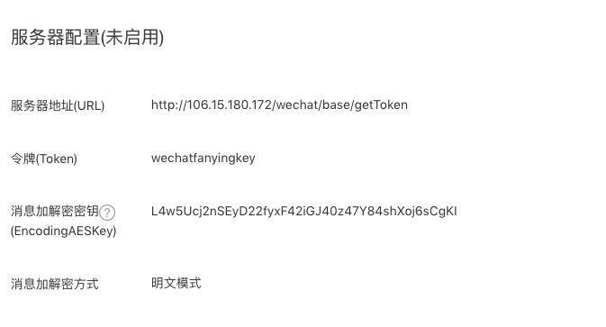
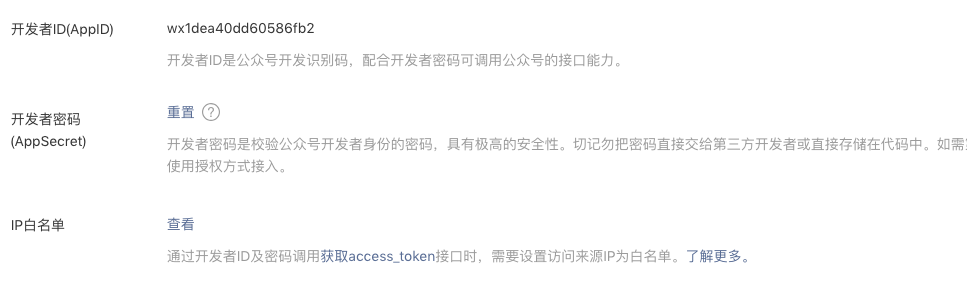
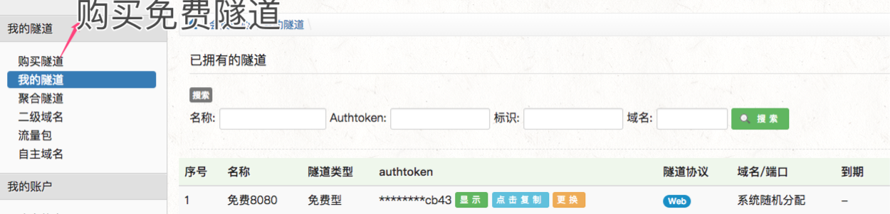
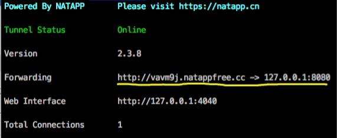

# WeChat开发

## [基本设置](https://mp.weixin.qq.com/wiki?t=resource/res_main&id=mp1472017492_58YV5)



现在有一台云服务器作为微信服务器，也就是说微信公众号的请求都转发到自己的微信服务器上来，现在来看上述配置的含义

​	Url : 微信服务器验证token是否可用的接口地址（这里的url地址必须是80或者443端口，可以使用端口转发实现）

​	token：自定义的令牌用来确定是否是微信公众号发来的请求

​	Aeskey: 消息体加解密秘钥

验证消息确实来自微信服务器

​	signature	微信加密签名，

​	timestamp	时间戳

​	nonce		随机数

​	echostr		随机字符串	

验证流程如下

​	微信服务器接收请求，将timestamp、nonce、自定义的token进行字典序排序，然后将三个字符串组合形成一个，再进行hash加密，如果得到的hashcode值和signature值一样，则返回echostr字符串，验证成功

其中自定义的token可以通过appId、APPSecret方式获取自己的token



```shell
https://api.weixin.qq.com/cgi-bin/token?grant_type=client_credential&appid=wx1dea40dd60586fb2{appId}&secret=9d7945c1d964966578774fb7ca46b50d{appSecret}

```

代码实现

```java
//控制类
@RequestMapping(value = "weixin",method = RequestMethod.GET)
    public String getToken
   (@RequestParam(value = "signature",required = false) String signature,
   @RequestParam(value = "nonce",required = false) String nonce,
   @RequestParam(value = "timestamp",required = false) String timestamp,
   @RequestParam(value = "echostr",required = false) String echostr
    ){
        Logger logger = LoggerFactory.getLogger(BaseMessageController.class);
        logger.info("请求参数是 ==> signature ==>" + signature);
        logger.info("请求参数是 ==> nonce ===>" + nonce);
        logger.info("请求参数是 ==> timestamp ==>" + timestamp);
        logger.info("请求参数是 ==> echostr ==>" + echostr);
        if(checkSignature(timestamp,nonce,signature)){
                return echostr;
        }
        //随便返回啥，只要不是echostr，就会判定失败
        return "failed";
    }
//验证是否是微信公众号请求
public static  boolean checkSignature(String timestamp,
                                      String nonce,
                                      String signature){

        List<String> checkList = new ArrayList<>();
        checkList.add(CommonParam.WECHAT_SERVER_KEY);
        checkList.add(nonce);
        checkList.add(timestamp);
        Collections.sort(checkList);
        String sha1Hex = DigestUtils.sha1Hex(checkList.get(0) + 
                                             checkList.get(1) + 
                                             checkList.get(2));
        if (signature.equals(sha1Hex)){
            return true;
        }
        return false;
    }
    
```


## 微信服务器测试环境搭建

目的：将自己的电脑作为微信服务器实现本地调试，微信个人订阅号的权限很少，测试号的权限多

- 首先[申请一个测试公众号](https://mp.weixin.qq.com/debug/cgi-bin/sandboxinfo?action=showinfo&t=sandbox/index)

- 通过工具将自己电脑能通过外网的域名访问，也就是ngrok，国内的ngrok工具推荐 [natnpp](https://natapp.cn/)

然后注册一个账号，创建一个免费的隧道，



​	下载需要的客户端到电脑本地解压后，

​	命令行方式启动工具（mac）

```shell
cd ${natappDir}
./natapp -authtoken=${图上的token}
```

​	如果出现如下图视为成功



​	黄线中表示将外网的地址映射为本地 的8080端口

## 消息服务：

简单说就是订阅者和公众号交互的过程，消息服务接口地址和之前验证token的地址是一样的，但是请求方式不一样，验证token的请求是get请求，接收消息是post请求，并且发送过来的数据是xml方式

注意：

​	公众号在发送请求5s内收不到响应会断开连接并且重新发起请求，总共三次

### [接收、返回普通消息](https://mp.weixin.qq.com/wiki?t=resource/res_main&id=mp1421140453)

#### 文本消息

```xml
<!-- 接收格式如下 -->
<xml>
   	 <!-- 开发者微信号 -->
     <ToUserName><![CDATA[hgf1641197217]]></ToUserName>
     <!-- 发送方帐号（一个OpenID）-->
     <FromUserName><![CDATA[fanying]]></FromUserName>
     <!-- 消息创建时间 （整型） -->
     <CreateTime>1460537339</CreateTime>
     <!-- text(消息类型，文本消息固定为text) -->
     <MsgType><![CDATA[text]]></MsgType>
     <!-- 文本消息内容 -->
     <Content><![CDATA[欢迎开启公众号开发者模式]]></Content>
     <!-- 消息id，64位整型 -->
     <MsgId>6272960105994287618</MsgId>
</xml>

<!-- 返回的消息格式如下 -->
<xml>
      <Content>回复消息内容</Content>
      <!-- 接收方账号（openID），对应上文中的发送方账号 -->
      <ToUserName>fanying</ToUserName>
      <!-- 发送方账号，对应上文的开发者微信号 -->
      <FromUserName>hgf1641197217</FromUserName>
      <CreateTime>1460537339</CreateTime>
      <MsgId>6272960105994287618</MsgId>
      <MsgType>text</MsgType>
</xml>
```

上代码：

```java
	//这里的请求路径是相同的，只是请求方式不同，这里是post
	@RequestMapping(value = "weixin",method = RequestMethod.POST)
    @MessageHandler
    public Object textMessageInfo(HttpServletRequest httpServletRequest){
       //这里封装公用方法，将请求中xml格式的数据转为json对象
        JSONObject jsonObject = MessageUtil.xmlToMap(httpServletRequest);
        if (jsonObject.get(CommonParam.MESSAGE_TYPE) != null){
			//返回自定义的字符串，否则微信服务器默认会认为我们的微信服务器异常
            return baseMessageHelper.parseMessageInfo(jsonObject);
        }
        return CommonParam.WECHAT_REPLY_TEXT_SUCCESS;
    }
//============================ BaseMessageHelper ============================
public Object parseMessageInfo(JSONObject jsonObject){
        if (jsonObject == null)return null;

        String messageType = jsonObject.getString(CommonParam.MESSAGE_TYPE);
        if ("text".equals(messageType)){
            return parseTextMessageInfo(JSON.parseObject(jsonObject.toJSONString(),TextMessageInfo.class));
        }
        return null;
    }

    public BaseMessageInfo parseTextMessageInfo(TextMessageInfo textMessageInfo){
        String content = textMessageInfo.getContent();

        if (content.contains("123")){

//            BeanUtils.copyProperties(textMessageInfo,);
        }

        textMessageInfo.setContent("欢迎关注帆影ing公众号");
        return textMessageInfo;
    }
//========================== ReplyMessageAspect ========================
//切面环绕增强，处理返回值
Around("pointCut()")
    public Object postHandlerReplyMessage(ProceedingJoinPoint proceedingJoinPoint){
        BaseMessageInfo baseMessageInfo = null;
        try {
            Object proceed = proceedingJoinPoint.proceed();
            baseMessageInfo = (BaseMessageInfo) proceed;


            String fromUserName = baseMessageInfo.getFromUserName();
            String toUserName = baseMessageInfo.getToUserName();
			//指定收消息的人
            baseMessageInfo.setToUserName(fromUserName);
            baseMessageInfo.setFromUserName(toUserName);
			//将返回的值转为 xml格式的数据
            XStream xstream = new XStream();
            xstream.alias("xml", proceed.getClass());
            return xstream.toXML(baseMessageInfo);


        } catch (Throwable throwable) {
            throwable.printStackTrace();
        }

        return baseMessageInfo;
    }

```


​	

